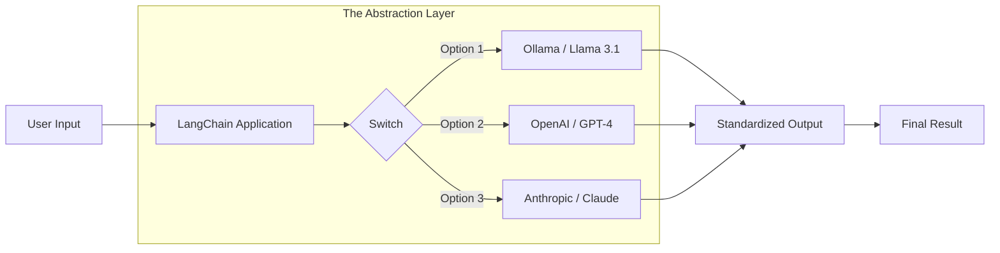
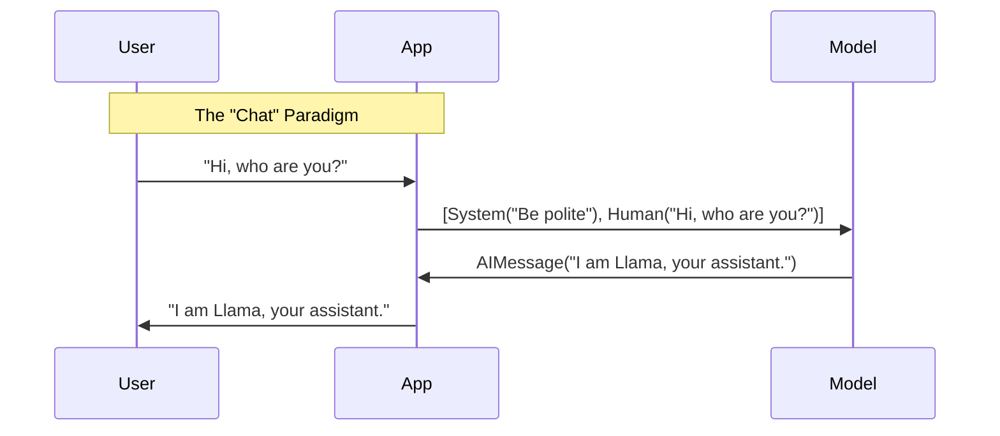

# Module 1: LangChain Basics & Models (Week 1)

Welcome to **LangChain Zero-to-Hero**. I'm **Dr. Elena Chen**, and I am absolutely thrilled to be your guide on this journey.

If you've been hearing the buzz about "Agents," "RAG," and "LangGraph" but felt overwhelmed by the jargon, you are in the right place. By the end of this module, you won't just *know* what LangChain is—you'll understand *why* it exists, how it thinks, and you'll have built your first real AI applications running entirely on your own computer.

We are going to focus on **local models** using Ollama. This is the future of privacy-first AI development. No API keys, no credit cards, just pure engineering.

Let's dive in.

---

## Learning Objectives

By the end of this module, you will be able to:
1.  **Articulate the "Why":** Explain exactly what problem LangChain solves and why we don't just call model APIs directly.
2.  **Distinguish Model Types:** deeply understand the difference between raw LLMs (Text-in/Text-out) and modern Chat Models (Messages-in/Message-out).
3.  **Master ChatOllama:** Initialize, configure, and invoke local Llama 3.1 and Mistral models using Python.
4.  **Manipulate Messages:** Construct complex prompts using `SystemMessage`, `HumanMessage`, and `AIMessage`.
5.  **Build Your First App:** Create a fully functional CLI chatbot that runs locally.

---

## Prerequisites & Setup

Before we write a single line of code, we need to ensure our "lab" is ready. Since we are using local models, your hardware is the limit, but don't worry—modern quantized models run beautifully on most laptops.

### 1. The Engine: Ollama
You should have Ollama installed and running. Open your terminal and verify:

```bash
ollama --version
# Output should be something like: ollama version is 0.3.x
```

Make sure you have our two primary models pulled. We will use **Llama 3.1** (Meta's latest powerhouse) and **Mistral** (a highly efficient European model) to see how LangChain handles different "brains."

```bash
ollama pull llama3.1
ollama pull mistral
```

### 2. The Toolkit: Python Packages
We need the specific LangChain integration for Ollama. In 2025, LangChain is "split-packaged," meaning we don't just install one giant blob anymore. We install exactly what we need.

Run this in your VS Code terminal (ensure your virtual environment is active):

```bash
pip install -U langchain langchain-ollama langchain-core
```

*   `langchain`: The main orchestration library.
*   `langchain-ollama`: The specific bridge to talk to your local Ollama instance.
*   `langchain-core`: The foundational protocols (LCEL) that make everything compatible.

---

## Understand what LangChain is and why it's needed

Imagine you are building a house.
*   **The LLM (Llama 3.1)** is the **electricity**. It's raw power, capable of doing amazing things, but dangerous and hard to use if you just plug directly into the main line.
*   **LangChain** is the **wiring, the switches, the outlets, and the appliances**. It takes that raw power and channels it into something useful, safe, and structured.

### The "Glue" Analogy
At its simplest, LangChain is a framework for **orchestration**.

If you just want to ask ChatGPT a question, you don't need LangChain. You just use the website.
But what if you want to:
1.  Ask a question.
2.  Take the answer and format it as JSON.
3.  Use that JSON to search a database.
4.  Summarize the database results.
5.  Send an email with the summary.

Doing this with raw API calls results in "spaghetti code"—messy, hard to maintain, and fragile. LangChain provides a standard interface (the **Runnable** protocol) so you can snap these steps together like LEGO bricks.

### The Standardization Power
One of LangChain's superpowers is **abstraction**.

Today, you might use **Llama 3.1**. Tomorrow, **GPT-5** comes out. Next week, **Claude 4.5**.
Without LangChain, switching models might mean rewriting your entire codebase because OpenAI expects `{"messages": [...]}` while Anthropic expects `{"system": "...", "prompt": "..."}`.

With LangChain, you just change one line of code:

```python
# Switch from this...
model = ChatOllama(model="llama3.1")

# ...to this
model = ChatOpenAI(model="gpt-4o")
```

The rest of your application—your prompts, your memory, your logic—stays exactly the same.



---

## Difference between LLMs (text-in/text-out) and Chat Models (messages-in/message-out)

This is a distinction that trips up almost everyone. In 2025, we almost exclusively use **Chat Models**, but understanding the history helps you understand the code.

### The Old Way: Pure LLMs (Completion)
Originally, models like GPT-3 were "text completion" engines. You gave them a string, and they tried to predict the next words.
*   **Input:** "The capital of France is"
*   **Output:** " Paris."

They didn't understand "conversations." They just understood "continuing the pattern."

### The Modern Way: Chat Models
Modern models (Llama 3, GPT-4, Claude) are fine-tuned for **conversation**. They don't just take a string; they take a **list of messages**.

Each message has a **Role** and **Content**.

| Role | Who is it? | Purpose |
| :--- | :--- | :--- |
| **System** | The God Mode | Sets the behavior, tone, and rules. (e.g., "You are a helpful assistant.") |
| **Human** | The User | The actual input or question. |
| **AI** | The Model | The response generated by the model. |

LangChain represents these as Python classes: `SystemMessage`, `HumanMessage`, and `AIMessage`.



---

## Using `ChatOllama`

Let's write some code. We will use `ChatOllama`, which is LangChain's standard interface for any model running via Ollama.

### Example 1: Your First Chat Model Interaction

**What we're about to build:**
A minimal script that initializes the Llama 3.1 model and asks it a simple question.

**Imports explained:**
*   `ChatOllama`: The class that wraps the Ollama API. It behaves exactly like `ChatOpenAI` or `ChatAnthropic`.
*   `HumanMessage`: Represents the user's input in the chat format.

```python
from langchain_ollama import ChatOllama
from langchain_core.messages import HumanMessage

# 1. Initialize the model
# temperature=0 means "be precise and deterministic"
# temperature=1 means "be creative and random"
llm = ChatOllama(
    model="llama3.1",
    temperature=0.7,
)

# 2. Create a message
# We wrap our string in a HumanMessage to be explicit
messages = [
    HumanMessage(content="What is the boiling point of water? Answer briefly.")
]

# 3. Invoke the model
# .invoke() is the standard method in LangChain v0.3 to call ANY runnable
response = llm.invoke(messages)

# 4. Print the result
print(response.content)
```

**Expected output:**
```text
The boiling point of water is 100 degrees Celsius (212 degrees Fahrenheit) at standard atmospheric pressure.
```

**Why this works — breakdown:**
1.  **`ChatOllama(...)`**: This doesn't actually call the model yet. It just sets up the configuration. It's like buying a phone but not dialing a number yet.
2.  **`messages = [...]`**: We created a list. Even though it's just one message, Chat Models expect a list.
3.  **`llm.invoke(messages)`**: This is the magic moment. LangChain takes your list, converts it into the JSON format Ollama expects, sends the HTTP request to `localhost:11434`, waits for the response, parses the JSON coming back, and wraps the text in an `AIMessage` object.
4.  **`response.content`**: The `response` object contains metadata (token usage, finish reason), but usually, we just want the `.content`.

---

### Example 2: Using System Messages for Role Playing

**What we're about to build:**
We will make the model behave like a pirate. This demonstrates the power of the `SystemMessage`.

**Imports explained:**
*   `SystemMessage`: Used to steer the behavior of the model.

```python
from langchain_ollama import ChatOllama
from langchain_core.messages import HumanMessage, SystemMessage

llm = ChatOllama(model="llama3.1", temperature=1.0) # High temp for creativity

messages = [
    SystemMessage(content="You are a grumpy pirate captain. Speak only in pirate slang."),
    HumanMessage(content="Where is the nearest grocery store?")
]

response = llm.invoke(messages)

print(f"Role: {response.type}")
print(f"Content: {response.content}")
```

**Expected output:**
```text
Role: ai
Content: Arrr, ye scurvy landlubber! Why be ye askin' me about grocer's shops? I only know the way to the nearest tavern and where X marks the spot! Be gone with ye!
```

**Why this works — breakdown:**
The `SystemMessage` is prepended to the conversation. Llama 3.1 sees "You are a pirate" *before* it sees your question. This "primes" the model's internal state to attend to pirate-related tokens.

---

### Example 3: Streaming Responses (The "ChatGPT Effect")

**What we're about to build:**
You know how ChatGPT types out the answer word by word? That's called **streaming**. It makes the app feel faster because the user doesn't have to wait for the whole answer to be generated.

**Imports explained:**
*   No new imports, just a new method: `.stream()`.

```python
from langchain_ollama import ChatOllama
from langchain_core.messages import HumanMessage

llm = ChatOllama(model="llama3.1")

messages = [HumanMessage(content="Tell me a short story about a brave toaster.")]

print("Streaming response...")

# Instead of .invoke(), we use .stream()
# It returns an iterator that yields chunks of the response
for chunk in llm.stream(messages):
    # end="" prevents Python from adding a new line after every chunk
    # flush=True forces the output to appear immediately
    print(chunk.content, end="", flush=True)
```

**Expected output:**
(Text appears character by character or token by token on your screen)
```text
Once upon a time, in a bustling kitchen... [text continues flowing]
```

**Why this works — breakdown:**
*   **`.invoke()`** waits for the *entire* generation to finish (which might take 5 seconds) before returning anything.
*   **`.stream()`** opens a persistent connection. As soon as Llama 3.1 generates a token (a piece of a word), it pushes it to us.
*   The `chunk` variable is actually a tiny `AIMessageChunk`. When you add them together, they form the full `AIMessage`.

---

## Hands-on Exercise: The Model Battle ⚔️

Let's put your skills to the test. We are going to compare **Llama 3.1** and **Mistral** side-by-side.

**Goal:** Write a script that asks both models the same logical reasoning question and prints their answers.

**Code:**

```python
from langchain_ollama import ChatOllama
from langchain_core.messages import HumanMessage

# 1. Define our two contenders
llama_model = ChatOllama(model="llama3.1")
mistral_model = ChatOllama(model="mistral")

# 2. The tricky question
question = "If I hang 5 shirts outside and they take 5 hours to dry, how long will it take to dry 10 shirts? Explain your reasoning."
messages = [HumanMessage(content=question)]

print("--- Llama 3.1 Response ---")
llama_response = llama_model.invoke(messages)
print(llama_response.content)

print("\n--- Mistral Response ---")
mistral_response = mistral_model.invoke(messages)
print(mistral_response.content)
```

**Expected output (approximate):**
Both models *should* say "5 hours" (because they dry in parallel). If one says "10 hours," you've caught a hallucination! This is why testing multiple models is crucial in AI engineering.

---

## Mini-Project: Local CLI Chatbot 🤖

This is your capstone for Week 1. We are going to build a continuous chat loop.

**Features:**
1.  Runs in a `while` loop.
2.  Maintains a list of messages (Memory!) so it remembers context.
3.  Allows the user to type "exit" or "quit" to stop.
4.  Uses a System Message to give it a personality.

```python
from langchain_ollama import ChatOllama
from langchain_core.messages import HumanMessage, SystemMessage, AIMessage

# Setup
llm = ChatOllama(model="llama3.1")

# Initialize chat history with a system message
chat_history = [
    SystemMessage(content="You are a helpful and slightly witty AI assistant.")
]

print("🤖 Local Bot is ready! Type 'exit' to quit.")

while True:
    # 1. Get user input
    user_input = input("\nYou: ")
    
    # 2. Check for exit condition
    if user_input.lower() in ["exit", "quit"]:
        print("Goodbye! 👋")
        break
        
    # 3. Add user message to history
    chat_history.append(HumanMessage(content=user_input))
    
    # 4. Generate response
    # We pass the ENTIRE history to the model
    print("Bot: ", end="", flush=True)
    
    response_content = ""
    for chunk in llm.stream(chat_history):
        print(chunk.content, end="", flush=True)
        response_content += chunk.content
        
    print() # Newline after response
    
    # 5. Add AI response to history so it remembers for next time
    chat_history.append(AIMessage(content=response_content))

```

**Try it out:**
1.  Say "Hi, my name is Rahul."
2.  Wait for response.
3.  Say "What is my name?"
4.  If it answers "Rahul," congratulations! You just built a stateful chatbot.

**Why this works — breakdown:**
The "Memory" here is simply a Python list (`chat_history`).
*   Turn 1: `[System, Human]` -> Model -> `AI`
*   Turn 2: `[System, Human, AI, Human]` -> Model -> `AI`
*   Turn 3: `[System, Human, AI, Human, AI, Human]` ...

We are manually appending the `AIMessage` back to the list. In Module 4, we will learn how LangChain can automate this for us, but understanding this manual loop is **critical**.

---

## Quiz & Exercises

### Quiz
1.  **True or False:** `ChatOllama` runs the model in the cloud.
    *   *(Answer: False. It runs locally on your machine via the Ollama service.)*
2.  **What is the difference between `invoke` and `stream`?**
    *   *(Answer: `invoke` returns the full result at once; `stream` yields chunks of the result as they are generated.)*
3.  **Why do we use a `SystemMessage`?**
    *   *(Answer: To set the behavior, persona, or rules for the AI before the conversation starts.)*
4.  **If I want to change from Llama 3 to GPT-4, what do I need to change in my code?**
    *   *(Answer: Just the model initialization line (e.g., `ChatOpenAI`). The rest of the message logic remains the same.)*

### Challenge Exercise
Modify the **Local CLI Chatbot** to include a "reset" command.
*   If the user types "reset", clear the `chat_history` back to just the original SystemMessage and print "Memory wiped! 🧹".

---

## Further Reading & Resources

*   **Official Docs:** [LangChain Chat Models](https://python.langchain.com/docs/concepts/#chat-models)
*   **Ollama Library:** [Ollama Model Library](https://ollama.com/library) (Explore other models like `phi3` or `gemma2`)
*   **Deep Dive:** [Andrej Karpathy's "Intro to Large Language Models"](https://www.youtube.com/watch?v=zjkBMFhNj_g) (The holy grail of LLM theory)

---

**Great work on Module 1!** You have successfully set up your environment, understood the core architecture of LangChain, and built a working chatbot.

In **Module 2**, we will stop hard-coding strings and start using **Prompt Templates**—the secret weapon of prompt engineers. See you there!
