# Module 10: Advanced Topics (Week 12)

Welcome to the final module of your LangChain journey! You have come a long way—from basic prompts to complex RAG systems and agents.

Now, we are going to unlock the **superpowers** that turn a "cool script" into a **production-ready application**. We will cover **Streaming** (so your user doesn't stare at a blank screen), **Multi-Agent Systems** (where AI collaborates with AI), and **Human-in-the-loop** (where you stay in control).

## Learning Objectives

By the end of this module, you will be able to:
*   **Implement Streaming:** Make your LLM applications feel instant and responsive using `.stream()`.
*   **Build Multi-Agent Systems:** Orchestrate two agents (e.g., a Researcher and a Writer) to solve complex tasks using LangGraph.
*   **Add Human-in-the-loop:** Pause an agent's execution to get human approval before it takes a critical action.

## Prerequisites & Setup

Ensure you have your environment ready. We will be using **LangGraph** heavily today, as it is the standard for advanced orchestration in 2025.

### 1. Install/Update Packages
We need the latest versions of `langchain`, `langchain-ollama`, and `langgraph`.

```bash
pip install -U langchain langchain-ollama langgraph
```

### 2. Set up your Environment
Create a file named `advanced_setup.py` to test your connection.

```python
import os
from langchain_ollama import ChatOllama

# We are using Ollama for local, private, free inference.
# Ensure you have 'llama3.1' pulled: `ollama pull llama3.1`
llm = ChatOllama(model="llama3.1", temperature=0)

print("Environment check: Success! 🚀")
```

---

## Topic 1: Streaming

**The Problem:** LLMs are slow. If you ask for a long essay, the user might wait 10 seconds before seeing *anything*. This feels broken.
**The Solution:** **Streaming**. Instead of waiting for the whole response, we send chunks of text as soon as they are generated. This is how ChatGPT works.

### Visualizing the Flow

```mermaid
graph LR
    A[User Input] --> B[PromptTemplate]
    B --> C[LLM (Streaming)]
    C -.->|Chunk 1| D[Output Parser]
    C -.->|Chunk 2| D
    C -.->|Chunk 3| D
    D --> E[Terminal/UI]
    style C fill:#f9f,stroke:#333,stroke-width:2px
```

### What we're about to build
We will build a simple "Story Generator" that writes a story about a topic you choose. Instead of waiting for the full story, we will see it appear character by character in your terminal.

### Imports explained
*   `ChatOllama`: Our chat model wrapper.
*   `StrOutputParser`: Converts the raw message object from the LLM into a simple string, which is easier to stream.

### Code Example: Basic Streaming

```python
from langchain_ollama import ChatOllama
from langchain_core.output_parsers import StrOutputParser
from langchain_core.prompts import ChatPromptTemplate

# 1. Create the model
llm = ChatOllama(model="llama3.1")

# 2. Create a prompt
prompt = ChatPromptTemplate.from_template("Write a short, exciting story about {topic}.")

# 3. Create the chain
# The pipe operator `|` connects the prompt -> model -> parser
chain = prompt | llm | StrOutputParser()

print("--- Generating Story (Streaming) ---")

# 4. Stream the output
# Instead of chain.invoke(), we use chain.stream()
full_response = ""
for chunk in chain.stream({"topic": "a cybernetic ninja cat"}):
    # 'chunk' is a small piece of text (token)
    print(chunk, end="", flush=True)
    full_response += chunk

print("\n\n--- Done! ---")
```

### Expected Output
```text
--- Generating Story (Streaming) ---
In the neon-drenched alleyways of Neo-Tokyo, Whiskers wasn't your average stray...
(The text appears rapidly, token by token, just like in a sci-fi movie)
--- Done! ---
```

### Why this works — breakdown
1.  **`chain.stream(...)`**: This is the magic method. It returns an *iterator*.
2.  **The Loop**: As the LLM generates tokens, `chain.stream` yields them immediately.
3.  **`print(..., end="", flush=True)`**: This prints the chunk without a newline (`end=""`) and forces it to appear on the screen immediately (`flush=True`), creating the typewriter effect.

> [!TIP]
> **Pro Tip:** In a web app (like Streamlit or FastAPI), you would return a `StreamingResponse` that yields these chunks to the browser!

---

## Topic 2: Multi-Agent Systems

**The Problem:** A single agent trying to do everything (research, write, code, debug) often gets confused or hallucinates.
**The Solution:** **Multi-Agent Systems**. Split the work. Have one agent be the "Researcher" and another be the "Writer". Specialized agents perform better.

### Visualizing the Graph


### What we're about to build
We will build a **Research & Write** team using **LangGraph**.
*   **Agent A (Researcher):** Generates key facts about a topic.
*   **Agent B (Writer):** Takes those facts and writes a polished paragraph.
*   **Graph:** Connects them sequentially.

### Imports explained
*   `StateGraph`: The blueprint for our multi-agent workflow.
*   `START`, `END`: Special nodes representing the beginning and end of the graph.
*   `TypedDict`: Python's way to define the "State" (the shared memory) of our graph.

### Code Example: The Researcher-Writer Duo

```python
from typing import TypedDict
from langchain_ollama import ChatOllama
from langchain_core.prompts import ChatPromptTemplate
from langchain_core.output_parsers import StrOutputParser
from langgraph.graph import StateGraph, START, END

# --- 1. Define the State ---
# This is the shared "clipboard" passed between agents.
class State(TypedDict):
    topic: str
    facts: str
    final_draft: str

# --- 2. Define the Agents (Nodes) ---
llm = ChatOllama(model="llama3.1", temperature=0)

def researcher_agent(state: State):
    """Finds facts about the topic."""
    print(f"🔎 Researcher is looking up: {state['topic']}...")
    
    # In a real app, this would use a Search Tool. Here, we simulate it with the LLM.
    prompt = ChatPromptTemplate.from_template(
        "List 3 key interesting facts about {topic}. Be concise."
    )
    chain = prompt | llm | StrOutputParser()
    facts = chain.invoke({"topic": state["topic"]})
    
    # Update the state with the new facts
    return {"facts": facts}

def writer_agent(state: State):
    """Writes a draft based on the facts."""
    print("✍️ Writer is drafting...")
    
    prompt = ChatPromptTemplate.from_template(
        "You are a tech blogger. Write a short paragraph using these facts:\n{facts}"
    )
    chain = prompt | llm | StrOutputParser()
    draft = chain.invoke({"facts": state["facts"]})
    
    # Update the state with the final draft
    return {"final_draft": draft}

# --- 3. Build the Graph ---
workflow = StateGraph(State)

# Add nodes
workflow.add_node("Researcher", researcher_agent)
workflow.add_node("Writer", writer_agent)

# Define the flow: Start -> Researcher -> Writer -> End
workflow.add_edge(START, "Researcher")
workflow.add_edge("Researcher", "Writer")
workflow.add_edge("Writer", END)

# Compile the graph
app = workflow.compile()

# --- 4. Run It ---
result = app.invoke({"topic": "The James Webb Space Telescope"})

print("\n--- Final Result ---")
print(result["final_draft"])
```

### Expected Output
```text
🔎 Researcher is looking up: The James Webb Space Telescope...
✍️ Writer is drafting...

--- Final Result ---
The James Webb Space Telescope (JWST) is a marvel of modern engineering... (A polished paragraph incorporating the facts)
```

### Why this works — breakdown
1.  **`State`**: Acts as the memory. The `Researcher` writes to `facts`, and the `Writer` reads `facts` and writes to `final_draft`.
2.  **Separation of Concerns**: The Researcher doesn't worry about tone; the Writer doesn't worry about accuracy. Each focuses on one job.
3.  **`workflow.add_edge`**: Explicitly defines the hand-off. The output of Researcher *always* goes to Writer.

---

## Topic 3: Human-in-the-loop

**The Problem:** Agents are powerful, but sometimes they make mistakes. You don't want an agent sending an email or deleting a file without checking first.
**The Solution:** **Human-in-the-loop**. We tell LangGraph to *pause* execution before a specific node, wait for human input (approve/reject/edit), and then resume.

### Visualizing the Interruption

```mermaid
graph TD
    Start((START)) --> Researcher
    Researcher --> Interrupt[⏸️ PAUSE]
    Interrupt --> Human{Human Review}
    Human -- Approve --> Writer
    Human -- Reject --> Researcher
    Writer --> End((END))
    
    style Interrupt fill:#ff9,stroke:#333,stroke-width:2px
```



### What we're about to build
We will modify our previous graph. Before the `Writer` publishes the final draft, we will add a **Human Review** step. If the human says "approve", it finishes. If "reject", it goes back to the Researcher.

### Imports explained
*   `MemorySaver`: A simple in-memory checkpointer. This allows the graph to "pause" and "resume" by saving its state.

### Code Example: The "Manager's Approval" Workflow

```python
from langgraph.checkpoint.memory import MemorySaver

# ... (Previous imports and State definition remain the same) ...

# --- Modified Agents ---
# We'll use the same researcher and writer functions from above.

def human_review_node(state: State):
    """A dummy node just to represent the review state."""
    pass # The logic happens in the conditional edge

# --- Conditional Logic ---
def should_continue(state: State):
    """Decides if we publish or retry based on human input."""
    # In a real app, we'd read this from the state updated by the human.
    # For this CLI example, we'll ask for input directly here or assume the state was updated.
    
    # Let's assume the human input is injected into the state key 'feedback'
    feedback = state.get("feedback", "approve")
    
    if feedback == "approve":
        return "end"
    else:
        return "research"

# --- Build the Graph with Checkpointer ---
workflow = StateGraph(State)
workflow.add_node("Researcher", researcher_agent)
workflow.add_node("Writer", writer_agent)

# Start -> Researcher -> Writer
workflow.add_edge(START, "Researcher")
workflow.add_edge("Researcher", "Writer")

# After Writer, we go to a conditional edge
# But wait! We want to PAUSE *before* finishing.
# Actually, a better pattern is: Researcher -> Writer -> interrupt -> (Human decides)

# Let's use the 'interrupt_before' feature of LangGraph.
# We will compile the graph with a checkpointer.

checkpointer = MemorySaver()
app = workflow.compile(checkpointer=checkpointer, interrupt_before=["Writer"]) 
# ^ This tells LangGraph: "Stop right before you execute the 'Writer' node."

# --- Running with Human-in-the-loop ---

# 1. Start the thread
thread_config = {"configurable": {"thread_id": "1"}}
print("--- Starting Workflow ---")
app.invoke({"topic": "Quantum Computing"}, config=thread_config)

# The graph runs 'Researcher' and then STOPS before 'Writer'.
# We can now inspect the state.
current_state = app.get_state(thread_config)
print(f"\n⏸️ Paused! Current State (Facts found): \n{current_state.values['facts']}")

# 2. Human Intervention
user_input = input("\nDo these facts look good? (yes/no): ")

if user_input.lower() == "yes":
    print("✅ Approved! Resuming to write draft...")
    # Resume execution - it will pick up right before 'Writer'
    result = app.invoke(None, config=thread_config)
    print("\n--- Final Draft ---")
    print(result["final_draft"])
else:
    print("❌ Rejected. (In a full app, we would update state and route back to Researcher)")
```

### Why this works — breakdown
1.  **`interrupt_before=["Writer"]`**: This is the key. It forces the graph to halt execution *just before* entering the Writer node.
2.  **`checkpointer`**: Saves the state (the facts found so far) to memory. Without this, the graph would forget everything when it pauses.
3.  **`app.invoke(None, ...)`**: When we call invoke again with the same `thread_id`, LangGraph sees the paused state and resumes from exactly where it left off.

---

## Hands-on Project: The "Tweet Factory" 🏭

Let's combine everything! We will build a **Multi-Agent Tweet Generator** with **Human Approval**.

**The Flow:**
1.  **Idea Agent**: Generates a tweet idea about a topic.
2.  **Critique Agent**: Critiques the idea (too boring? too long?).
3.  **Human**: Reviews the critique.
    *   If Human says "Go": **Writer Agent** writes the final tweet.
    *   If Human says "Retry": Back to Idea Agent.

### Step 1: Define State
```python
class TweetState(TypedDict):
    topic: str
    idea: str
    critique: str
    final_tweet: str
    feedback: str # Human feedback
```

### Step 2: Define Nodes
*(Write these functions yourself! Use the patterns above)*
*   `generate_idea`: Prompts LLM for a tweet idea.
*   `critique_idea`: Prompts LLM to critique the idea.
*   `write_tweet`: Prompts LLM to write the final tweet based on idea + critique.

### Step 3: Build Graph
*   Start -> `generate_idea` -> `critique_idea`
*   **Interrupt** after `critique_idea`.
*   Human checks the state (sees idea + critique).
*   Resume -> `write_tweet` -> End.

### Step 4: Run & Test
Run it with the topic "LangChain". See the idea, see the critique, and then give the green light to publish!

---

## Quiz & Exercises

1.  **Streaming**: Why do we use `chain.stream()` instead of `chain.invoke()`?
2.  **State**: In LangGraph, if Agent A wants to pass data to Agent B, where must that data be stored?
3.  **Human-in-the-loop**: What is the purpose of a `checkpointer` when pausing a graph?

**Challenge:** Modify the "Tweet Factory" to include a loop. If the Critique Agent says the idea is "BAD", automatically send it back to the Idea Agent *without* human intervention. Only ask the human if the Critique is "GOOD".

## Further Reading & Resources

*   [LangGraph Documentation](https://langchain-ai.github.io/langgraph/) - The official bible for agents.
*   [LangChain Streaming Guide](https://python.langchain.com/docs/how_to/streaming/) - Deep dive into streaming tokens.
*   [Human-in-the-loop Patterns](https://langchain-ai.github.io/langgraph/how-tos/human_in_the_loop/) - Advanced approval workflows.

---
**Congratulations!** You have completed Module 10. You now possess the skills to build complex, reliable, and user-friendly AI applications. You are no longer just a scripter; you are an **AI Engineer**. 🎓
