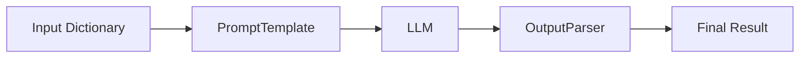

# Module 2: Prompts & Output Parsers (Week 2)

## Learning Objectives
By the end of this module, you will be able to:
- **Master Prompt Engineering in Code**: Move beyond simple strings to robust, reusable `PromptTemplate` and `ChatPromptTemplate` objects.
- **Control the Input**: Use `FewShotPromptTemplate` to guide models with examples, drastically improving performance on complex tasks.
- **Tame the Output**: Stop parsing regex manually! Use `StrOutputParser` and `JsonOutputParser` to get clean, structured data every time.
- **Build Your First Chains**: Understand the core of LangChain—**LCEL** (LangChain Expression Language)—and how to pipe components together (`|`) to create powerful workflows.

## Prerequisites & Setup
You should have your environment set up from Module 1. We will be using **Ollama** locally.

**Required Packages:**
Ensure you have the latest versions installed:
```bash
pip install -qU langchain langchain-ollama langchain-core
```

**Environment Variables:**
Make sure your `.env` file is loaded if you are using any API keys (though for Ollama, we usually don't need one).

```python
# Standard setup for every script in this module
import os
from dotenv import load_dotenv

load_dotenv() # Load variables from .env
```

---

## Topic 1: Prompt Templates (Basic & Chat)

In Week 1, we probably sent raw strings to the model like `llm.invoke("Tell me a joke")`. That works for toy examples, but in production, prompts are **dynamic**. You need to inject user input, context, and instructions systematically.

Enter **PromptTemplates**. Think of them as **f-strings on steroids**. They separate the *structure* of the prompt from the *inputs*.

### 1.1 The Basic `PromptTemplate`
Use this for raw text LLMs (though less common now) or simple string formatting.

#### What we're about to build
We'll create a reusable template that generates a "welcome email" for a new customer. We only want to provide the name and the product they bought, and let the template handle the polite phrasing.

#### Imports explained
- `PromptTemplate`: The class that holds our template string and knows how to inject variables.

```python
from langchain_core.prompts import PromptTemplate

# Define the template with placeholders in {curly_brackets}
email_template = PromptTemplate.from_template(
    "Subject: Welcome to {company_name}!\n\n"
    "Dear {customer_name},\n\n"
    "Thank you for purchasing the {product_name}. We hope you enjoy it!\n\n"
    "Best,\nThe {company_name} Team"
)

# "Format" the template to see the final string (no LLM call yet!)
formatted_email = email_template.format(
    company_name="TechNova",
    customer_name="Alice",
    product_name="Quantum Toaster"
)

print(formatted_email)
```

#### Expected output
```text
Subject: Welcome to TechNova!

Dear Alice,

Thank you for purchasing the Quantum Toaster. We hope you enjoy it!

Best,
The TechNova Team
```

#### Why this works — breakdown
- `PromptTemplate.from_template(...)`: This factory method parses your string and automatically detects variables like `{customer_name}`. You don't need to manually declare `input_variables`.
- `.format(...)`: This method replaces the placeholders with actual values. It returns a standard Python string. **Crucially**, this step happens *before* sending anything to the AI.

### 1.2 The `ChatPromptTemplate` (The Modern Standard)
Most modern models (Llama 3, GPT-4, Claude) are **Chat Models**. They don't just take a string; they take a list of **Messages**.
- **System Message**: High-level instructions (persona, rules).
- **Human Message**: The user's input.
- **AI Message**: The model's response.

`ChatPromptTemplate` helps you construct this list dynamically.

#### What we're about to build
A "Translator Bot" that takes a sentence and a target language, and translates it. We will enforce a strict persona using a System Message.

#### Imports explained
- `ChatPromptTemplate`: The builder for a list of chat messages.

```python
from langchain_core.prompts import ChatPromptTemplate

# Define a template with a System message (instructions) and Human message (input)
chat_template = ChatPromptTemplate.from_messages([
    ("system", "You are a helpful assistant that translates {input_language} to {output_language}."),
    ("human", "{text}")
])

# Format it to see what the model actually receives
messages = chat_template.format_messages(
    input_language="English",
    output_language="French",
    text="I love programming."
)

print(messages)
```

#### Expected output
```text
[
  SystemMessage(content='You are a helpful assistant that translates English to French.'), 
  HumanMessage(content='I love programming.')
]
```

#### Why this works — breakdown
- `from_messages([...])`: Takes a list of tuples `(role, content)`.
- `("system", ...)`: Sets the behavior. This is persistent context.
- `("human", ...)`: The variable part where user input goes.
- `.format_messages(...)`: Unlike `.format()` which returns a string, this returns a **list of Message objects**. This is exactly what `ChatOllama` expects.

---

## Topic 2: Few-Shot Prompting

Here is a secret: **The best way to get an AI to do what you want is to show it examples.** This is called "Few-Shot Prompting".

Instead of writing a 10-paragraph description of how to format the output, just give it 3 examples of `Input -> Output`.

#### What we're about to build
A "Slang Translator" that converts formal English into Gen Z slang. Without examples, the model might just add "bro" to the end. With examples, it learns the *style*.

#### Imports explained
- `FewShotChatMessagePromptTemplate`: A special template designed to inject a list of examples into the chat history.

```python
from langchain_core.prompts import ChatPromptTemplate, FewShotChatMessagePromptTemplate

# 1. Define our examples
examples = [
    {"input": "Hello, how are you?", "output": "Yo, what's good fam?"},
    {"input": "That is very impressive.", "output": "That goes hard, no cap."},
    {"input": "I am very tired.", "output": "I'm cooked."}
]

# 2. Define how each example should look
example_prompt = ChatPromptTemplate.from_messages([
    ("human", "{input}"),
    ("ai", "{output}")
])

# 3. Create the Few-Shot template
few_shot_prompt = FewShotChatMessagePromptTemplate(
    example_prompt=example_prompt,
    examples=examples
)

# 4. Assemble the final prompt
final_prompt = ChatPromptTemplate.from_messages([
    ("system", "You are a slang translator. Convert the user's text to Gen Z slang."),
    few_shot_prompt, # <--- The examples get inserted here!
    ("human", "{text}")
])

# Let's see what the model sees
print(final_prompt.format(text="The movie was excellent."))
```

#### Expected output
```text
System: You are a slang translator. Convert the user's text to Gen Z slang.
Human: Hello, how are you?
AI: Yo, what's good fam?
Human: That is very impressive.
AI: That goes hard, no cap.
Human: I am very tired.
AI: I'm cooked.
Human: The movie was excellent.
```

#### Why this works — breakdown
- The model sees the examples as **previous conversation history**.
- It "thinks" it has already translated 3 sentences correctly.
- When it sees the 4th one ("The movie was excellent"), it simply follows the pattern. This is significantly more reliable than just telling it "use slang words."

---

## Topic 3: Output Parsers (String, JSON)

By default, LLMs return a `AIMessage` object. Often, you just want the **string** content. Or even better, a **Python dictionary**.

### 3.1 `StrOutputParser`
The simplest parser. It takes the `AIMessage` and extracts the `.content` string.

#### What we're about to build
A simple chain that asks a question and gets a clean string back, not an object.

#### Imports explained
- `ChatOllama`: Our local model.
- `StrOutputParser`: Converts message objects to strings.

```python
from langchain_ollama import ChatOllama
from langchain_core.output_parsers import StrOutputParser

llm = ChatOllama(model="llama3.1") # Or "mistral"
parser = StrOutputParser()

# Simulate a response
response_message = llm.invoke("What is the capital of France?")
print(f"Raw Message: {type(response_message)}")

# Parse it
clean_text = parser.invoke(response_message)
print(f"Parsed: {type(clean_text)} -> {clean_text}")
```

#### Expected output
```text
Raw Message: <class 'langchain_core.messages.ai.AIMessage'>
Parsed: <class 'str'> -> The capital of France is Paris.
```

### 3.2 `JsonOutputParser` (Structured Data)
This is where the magic happens. You can force the LLM to output JSON, and LangChain will parse it into a real Python dictionary.

#### What we're about to build
A "Contact Extractor". We feed it a messy paragraph, and it extracts `name`, `email`, and `phone` into a clean JSON object.

#### Imports explained
- `JsonOutputParser`: Handles parsing JSON strings from the LLM.
- `PydanticOutputParser`: (Alternative) Uses Pydantic models for stricter validation (we'll stick to simple JSON for now).

```python
from langchain_core.prompts import PromptTemplate
from langchain_core.output_parsers import JsonOutputParser
from pydantic import BaseModel, Field

# 1. Define the desired data structure using Pydantic
# This tells the model EXACTLY what keys and types we want.
class ContactInfo(BaseModel):
    name: str = Field(description="The full name of the person")
    email: str = Field(description="The email address")
    phone: str = Field(description="The phone number, or 'N/A' if missing")

# 2. Set up the parser
parser = JsonOutputParser(pydantic_object=ContactInfo)

# 3. Create a prompt that INCLUDES the formatting instructions
prompt = PromptTemplate(
    template="Extract contact info from this text.\n{format_instructions}\n\nText: {text}",
    input_variables=["text"],
    partial_variables={"format_instructions": parser.get_format_instructions()}
)

# 4. The Chain (We'll explain the '|' syntax in the next section!)
chain = prompt | llm | parser

# 5. Run it
raw_text = "Please reach out to John Doe at john.doe@example.com or call him at 555-1234."
result = chain.invoke({"text": raw_text})

print(result)
print(f"Type: {type(result)}")
print(f"Email: {result['email']}")
```

#### Expected output
```text
{'name': 'John Doe', 'email': 'john.doe@example.com', 'phone': '555-1234'}
Type: <class 'dict'>
Email: john.doe@example.com
```

#### Why this works — breakdown
- `parser.get_format_instructions()`: This automatically generates a string like "You must output a JSON object with keys: name, email...". We inject this into the prompt.
- The LLM generates a JSON string.
- `parser.invoke(...)` takes that string, runs `json.loads()`, and gives you a dictionary.
- **Pro Tip**: Always use a model capable of following instructions (like Llama 3 or Mistral) for JSON tasks.

---

## Topic 4: RunnableSequence & LCEL

You've seen the `|` symbol above. This is **LCEL** (LangChain Expression Language). It is the heart of modern LangChain.

The pattern is always:


In code, this looks like a Unix pipe:
```python
chain = prompt | llm | parser
```

### Why use LCEL?
1. **Standard Interface**: Every runnable has `.invoke()`, `.stream()`, `.batch()`.
2. **Async Support**: You get `.ainvoke()` for free.
3. **Observability**: LangSmith traces the entire chain automatically.

#### What we're about to build
A "Joke Generator" chain.
1. **Prompt**: Takes a topic.
2. **Model**: Generates the joke.
3. **Parser**: Converts to string.

```python
# 1. Define the components
prompt = ChatPromptTemplate.from_template("Tell me a short joke about {topic}.")
model = ChatOllama(model="llama3.1")
output_parser = StrOutputParser()

# 2. Build the chain
chain = prompt | model | output_parser

# 3. Invoke
result = chain.invoke({"topic": "ice cream"})
print(result)
```

#### Expected output
```text
Why did the ice cream truck break down?
Because there was a rocky road ahead!
```

---

## Hands-on Project: The "Tweet Generator" 🐦

Let's put it all together. We will build a tool that generates 3 variations of a tweet for a given topic, tailored to a specific tone.

**Requirements:**
1. Input: `topic` (e.g., "AI is taking over") and `tone` (e.g., "Funny").
2. Output: A JSON object containing a list of 3 tweets.
3. Use `ChatPromptTemplate`, `ChatOllama`, and `JsonOutputParser`.

### The Code

```python
import os
from langchain_ollama import ChatOllama
from langchain_core.prompts import ChatPromptTemplate
from langchain_core.output_parsers import JsonOutputParser
from pydantic import BaseModel, Field
from typing import List

# --- 1. Setup Model ---
llm = ChatOllama(model="llama3.1", temperature=0.7)

# --- 2. Define Output Structure ---
class TweetList(BaseModel):
    tweets: List[str] = Field(description="A list of 3 distinct tweets about the topic")

parser = JsonOutputParser(pydantic_object=TweetList)

# --- 3. Create Prompt ---
# We inject the format instructions into the system message
system_template = """
You are a social media expert.
Your goal is to write tweets that go viral.
{format_instructions}
"""

human_template = """
Topic: {topic}
Tone: {tone}

Generate 3 variations.
"""

prompt = ChatPromptTemplate.from_messages([
    ("system", system_template),
    ("human", human_template)
])

# Partial formatting: We inject the instructions NOW so we don't have to pass them later
prompt = prompt.partial(format_instructions=parser.get_format_instructions())

# --- 4. Build Chain ---
tweet_chain = prompt | llm | parser

# --- 5. Run It ---
topic = "Learning Python"
tone = "Enthusiastic"

print(f"Generating {tone} tweets about: {topic}...\n")
response = tweet_chain.invoke({"topic": topic, "tone": tone})

# --- 6. Display Results ---
for i, tweet in enumerate(response['tweets'], 1):
    print(f"{i}. {tweet}")
```

### Expected Output
```text
Generating Enthusiastic tweets about: Learning Python...

1. Just wrote my first Python script and it actually works! 🐍💻 The feeling of seeing 'Hello World' pop up is unmatched. Can't wait to build more! #Python #CodingJourney #DevLife
2. Python is literally magic. ✨ You type a few lines and BAM, you have a working program. If you haven't started learning yet, this is your sign! 🚀 #LearnToCode #PythonProgramming
3. Weekend plans: Coffee ☕, VS Code 📝, and mastering Python lists! Who else is grinding on their coding skills today? Let's get it! 💪 #100DaysOfCode #Python
```

---

## Quiz & Exercises

### Quiz
1. **What is the difference between `PromptTemplate` and `ChatPromptTemplate`?**
   - *Hint: Think about strings vs. lists of messages.*
2. **Why do we use `parser.get_format_instructions()`?**
   - *Hint: How does the LLM know to output JSON?*
3. **What does the `|` operator do in Python when using LangChain?**
   - *Hint: It's not a bitwise OR.*

### Coding Exercise
**The "Code Reviewer"**
Create a chain that:
1. Takes a snippet of Python code as input.
2. Uses a System Message: "You are a senior Python engineer. Review the code for bugs and style."
3. Outputs a JSON object with keys: `bugs` (list of strings), `rating` (1-10), and `improved_code` (string).

*Good luck! You are now ready for Module 3, where we will dive deeper into Chains!*

---

## Further Reading & Resources
- [LangChain Documentation: Prompts](https://python.langchain.com/docs/concepts/#prompt-templates)
- [LangChain Documentation: Output Parsers](https://python.langchain.com/docs/concepts/#output-parsers)
- [LangChain Expression Language (LCEL)](https://python.langchain.com/docs/concepts/#langchain-expression-language-lcel)
