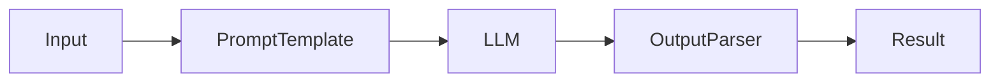
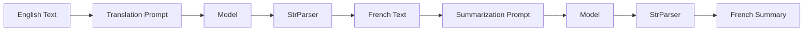
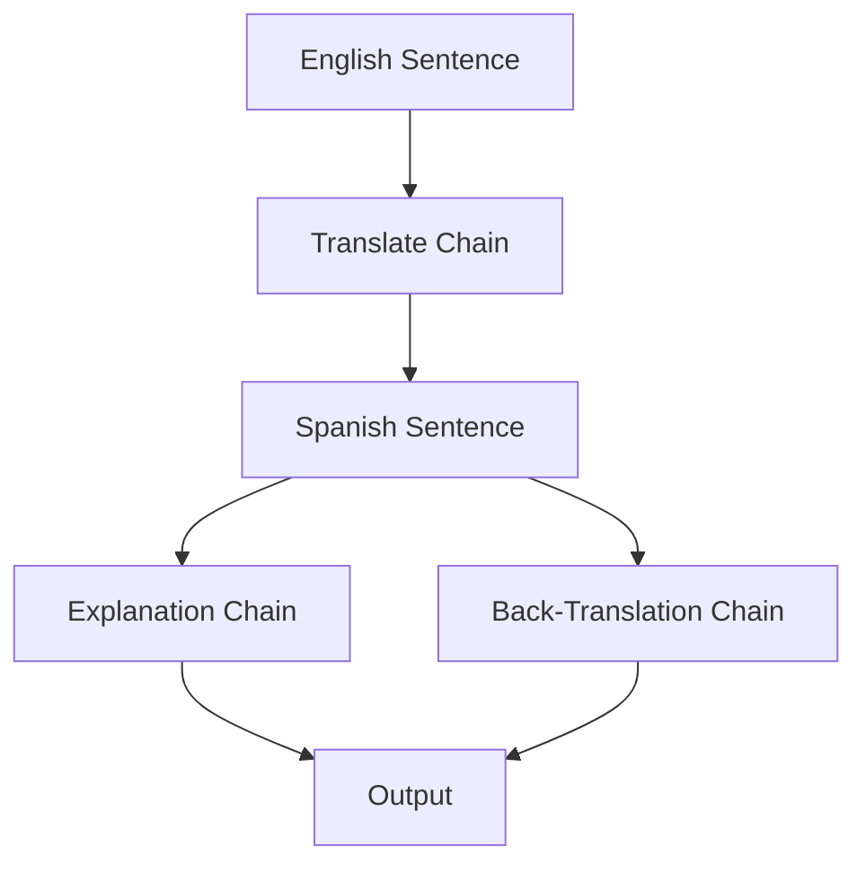

# Module 3: Chains & LCEL (Week 3)

## Learning Objectives
By the end of this module, you will be able to:
-   **Understand the "Why" behind LCEL**: Why LangChain moved from `LLMChain` to the **LangChain Expression Language (LCEL)**.
-   **Master the Pipe Operator (`|`)**: Compose complex workflows with Unix-like simplicity.
-   **Wield Core Runnables**: Use `RunnablePassthrough` and `RunnableLambda` to manipulate data flowing through your chains.
-   **Build Multi-Step Chains**: Create workflows that translate, summarize, and analyze text in a single pass.

## Prerequisites & Setup
Before we dive in, ensure your environment is ready. We'll be using **Ollama** with `llama3.1` (or `mistral`) and the latest LangChain v0.3 packages.

### 1. Install/Update Packages
Open your terminal and run:
```bash
pip install -U langchain langchain-ollama langchain-core
```

### 2. Verify Your Model
Make sure Ollama is running and you have the model:
```bash
ollama run llama3.1
```
*(Type `/bye` to exit)*

---

## The Revolution of LCEL (LangChain Expression Language)

Welcome to Week 3! If you've looked at LangChain tutorials from 2023, you might have seen things like `LLMChain`, `SimpleSequentialChain`, or `TransformChain`.

**Forget them.** 🛑

In late 2023/2024, LangChain underwent a massive paradigm shift. They introduced **LCEL** (LangChain Expression Language).

### Why the change?
Old LangChain was like a "Black Box". You created a `Chain` object, fed it inputs, and hoped for the best. Debugging was hard. Customizing was harder.

**LCEL** is like "Lego blocks". It's a declarative way to chain components together. It gives you:
1.  **Visibility**: You see exactly what feeds into what.
2.  **Streaming**: Built-in support for streaming tokens (typing effect).
3.  **Async**: Native asynchronous support.
4.  **Parallelism**: Run steps in parallel automatically.

Think of it this way:
*   **Old Way**: Ordering a "Surprise Menu" at a restaurant. You get what you get.
*   **LCEL**: A Buffet. You pick exactly what you want, in the order you want it.

---

## The Pipe Operator (`|`)

The heart of LCEL is the pipe operator `|`. If you've used Unix/Linux commands (e.g., `ls | grep .py`), you know this friend.

In Python, the `|` operator usually means "OR" (for sets) or "Bitwise OR". But LangChain has overloaded it to mean **"Pass the output of the left side as input to the right side."**

### The Basic Flow


In code, this looks like:
```python
chain = prompt | llm | output_parser
```

Let's build our first "Hello World" LCEL chain.

### Exercise 1: Your First LCEL Chain

#### What we're about to build
A simple chain that takes a topic and generates a joke about it. We'll use a Prompt, a Chat Model, and a String Parser.

#### Imports explained
*   `ChatOllama`: The chat model wrapper for our local Ollama instance.
*   `ChatPromptTemplate`: To structure our input (System + User messages).
*   `StrOutputParser`: Converts the raw `AIMessage` object from the LLM into a clean string.

```python
from langchain_ollama import ChatOllama
from langchain_core.prompts import ChatPromptTemplate
from langchain_core.output_parsers import StrOutputParser

# 1. Define the Prompt
prompt = ChatPromptTemplate.from_template("Tell me a short joke about {topic}.")

# 2. Define the Model
model = ChatOllama(model="llama3.1")

# 3. Define the Parser
parser = StrOutputParser()

# 4. Create the Chain using LCEL
chain = prompt | model | parser

# 5. Invoke the Chain
response = chain.invoke({"topic": "ice cream"})

print(response)
```

#### Expected output
```text
Why did the ice cream truck break down?
Because there was a rocky road!
```

#### Why this works — breakdown
1.  **`prompt`**: Takes `{"topic": "ice cream"}` and returns a `PromptValue` (a formatted list of messages).
2.  **`|`**: Passes that `PromptValue` to the `model`.
3.  **`model`**: Takes the messages, calls Llama 3.1, and returns an `AIMessage` object (e.g., `content="Why did..."`).
4.  **`|`**: Passes that `AIMessage` to the `parser`.
5.  **`parser`**: Extracts the `.content` string from the message.

---

## `RunnablePassthrough` & `RunnableLambda`

Real-world chains are rarely just `A -> B -> C`. Sometimes you need to:
*   Pass the user's input unchanged to a later step.
*   Add extra data (like the current date).
*   Run a custom Python function in the middle of the chain.

This is where **Runnables** come in. Every object in LCEL (Prompts, Models, Parsers) is a "Runnable". But there are two special ones you must know.

### 1. RunnablePassthrough
Allows you to pass inputs through unchanged or add extra keys to your input dictionary.

### 2. RunnableLambda
Allows you to turn *any* Python function into a chain step.

### Exercise 2: The Multi-Input Chain

#### What we're about to build
A chain that takes a "city" name, but also automatically calculates the number of letters in that city name, and asks the LLM to write a poem about the city using exactly that many lines.

#### Imports explained
*   `RunnablePassthrough`: Lets us pass the input "city" to the prompt while also calculating the length.
*   `RunnableLambda`: Wraps our custom length function.

```python
from langchain_core.runnables import RunnablePassthrough, RunnableLambda

# Custom function to count letters
def count_letters(inputs):
    return len(inputs["city"])

# 1. Define the Prompt
# Notice we expect {city} AND {line_count}
prompt = ChatPromptTemplate.from_template(
    "Write a poem about {city}. The poem must be exactly {line_count} lines long."
)

model = ChatOllama(model="llama3.1")
parser = StrOutputParser()

# 2. Define the Chain
chain = (
    {
        "city": RunnablePassthrough(), 
        "line_count": RunnableLambda(lambda x: len(x))
    }
    | prompt
    | model
    | parser
)

# 3. Invoke
# Note: We are passing a simple string "Paris", not a dict!
response = chain.invoke("Paris")

print(response)
```

#### Expected output
(A 5-line poem about Paris, since "Paris" has 5 letters)
```text
In the city of lights, love blooms,
Eiffel Tower pierces the sky,
Cafes bustle with lively tunes,
Seine River flows gently by,
Paris, mon amour, forever high.
```

#### Why this works — breakdown
This is the trickiest part for beginners! Let's look at the first step:
```python
{
    "city": RunnablePassthrough(), 
    "line_count": RunnableLambda(lambda x: len(x))
}
```
When we call `chain.invoke("Paris")`:
1.  The input `"Paris"` flows into this dictionary.
2.  **`"city": RunnablePassthrough()`**: Takes `"Paris"` and passes it through as the value for "city". -> `"city": "Paris"`
3.  **`"line_count": RunnableLambda(...)`**: Takes `"Paris"`, runs `len("Paris")`, and sets the result (5) as the value for "line_count". -> `"line_count": 5`
4.  **Result**: The prompt receives `{"city": "Paris", "line_count": 5}`.

> [!TIP]
> **Parallelism**: LangChain runs the keys in a dictionary in parallel! `RunnablePassthrough` and `RunnableLambda` execute at the same time.

---

## Hands-on Exercise: Translate -> Summarize Chain

Let's build the exercise mentioned in the roadmap. We will create a pipeline that:
1.  Translates English text to French.
2.  Takes that French text and summarizes it (in French).

### Visualizing the Flow


### The Code

#### What we're about to build
A sequential chain where the output of the first LLM call becomes the input for the second LLM call.

```python
from operator import itemgetter

# 1. Translation Step
translate_prompt = ChatPromptTemplate.from_template(
    "Translate the following text to French: {text}"
)
translate_chain = translate_prompt | model | StrOutputParser()

# 2. Summarization Step
summarize_prompt = ChatPromptTemplate.from_template(
    "Summarize the following text in one sentence: {text}"
)
summarize_chain = summarize_prompt | model | StrOutputParser()

# 3. Composition
# We pipe the output of translate_chain into summarize_chain
full_chain = (
    {"text": translate_chain} 
    | summarize_chain
)

text = """
LangChain is a framework for developing applications powered by language models. 
It enables applications that:
- Are context-aware: connect a language model to sources of context (prompt instructions, few shot examples, content to ground its response in, etc.)
- Reason: rely on a language model to reason (about how to answer based on provided context, what actions to take, etc.)
"""

result = full_chain.invoke({"text": text})
print(f"Final Summary (in French): {result}")
```

#### Expected output
```text
Final Summary (in French): LangChain est un cadre permettant de développer des applications contextuelles et raisonnées alimentées par des modèles linguistiques.
```

#### Why this works — breakdown
1.  **`{"text": translate_chain}`**: The input dict `{"text": ...}` is passed to `translate_chain`.
2.  **`translate_chain`**: Returns the full French translation string.
3.  **Mapping**: This French string is assigned to the key `"text"` in a new dictionary.
4.  **`| summarize_chain`**: This new dict `{"text": "LangChain est un cadre..."}` is passed to the summarize chain.

---

## Mini-Project: "Language Tutor" 🎓

Now for the capstone of this module! We will build a **Language Tutor** that helps you learn a language.

### The Goal
The user inputs a sentence in English. The Tutor will:
1.  **Translate** it to a target language (e.g., Spanish).
2.  **Explain** the grammar/vocabulary of the translation.
3.  **Verify** by translating it back to English to check if the meaning was preserved.

### The Architecture
We need three distinct chains, combined into one master chain.



### The Code

```python
# --- Step 1: Translation Chain ---
trans_prompt = ChatPromptTemplate.from_template(
    "Translate this English sentence to {language}: {sentence}"
)
trans_chain = trans_prompt | model | StrOutputParser()

# --- Step 2: Explanation Chain ---
explain_prompt = ChatPromptTemplate.from_template(
    "Analyze the grammar and vocabulary of this {language} sentence: '{sentence}'. Keep it brief and educational."
)
explain_chain = explain_prompt | model | StrOutputParser()

# --- Step 3: Back-Translation Chain ---
back_trans_prompt = ChatPromptTemplate.from_template(
    "Translate this {language} sentence back to English: '{sentence}'"
)
back_trans_chain = back_trans_prompt | model | StrOutputParser()

# --- Step 4: The Master Chain ---
# This is where the magic happens. We use RunnablePassthrough to branch data.

main_chain = (
    # First, get the translation
    RunnablePassthrough.assign(translation=trans_chain)
    # Now we have {language, sentence, translation}
    # We want to run explanation and back-translation in parallel
    | {
        "original": itemgetter("sentence"),
        "translation": itemgetter("translation"),
        "explanation": explain_chain,
        "back_translation": back_trans_chain
    }
)

# --- Run it! ---
inputs = {"language": "Spanish", "sentence": "I would like to order a coffee please."}
result = main_chain.invoke(inputs)

print(f"Original: {result['original']}")
print(f"Translation: {result['translation']}")
print(f"\n--- Explanation ---\n{result['explanation']}")
print(f"\n--- Back Translation Check ---\n{result['back_translation']}")
```

#### Expected output
```text
Original: I would like to order a coffee please.
Translation: Quisiera pedir un café, por favor.

--- Explanation ---
Here's a breakdown:
*   **Quisiera**: This is the imperfect subjunctive form of "querer" (to want). It's a polite way to say "I would like."
*   **pedir**: To order or ask for.
*   **un café**: A coffee.
*   **por favor**: Please.

--- Back Translation Check ---
I would like to order a coffee, please.
```

#### Why this works — breakdown
1.  **`RunnablePassthrough.assign(translation=trans_chain)`**: This is a super-power. It takes the input (`language`, `sentence`), runs `trans_chain` on it, and **adds** the result to the input under the key `translation`.
    *   Input state: `{"language": "Spanish", "sentence": "..."}`
    *   After `.assign`: `{"language": "Spanish", "sentence": "...", "translation": "Quisiera..."}`
2.  **The Dictionary**: We then map this enriched state to our final output keys.
    *   `explanation` uses `explain_chain`. Since `explain_chain` expects `{language, sentence}`, and our state has those (plus `translation`, which it ignores), it works perfectly! Wait, actually `explain_chain` needs the *translated* sentence.
    *   *Correction*: In my code above, `explain_chain` uses `{sentence}`. But in the dictionary step, the input to `explain_chain` is the *entire dictionary* from the previous step. So `explain_chain` sees `{"sentence": "...", "translation": "..."}`.
    *   **Crucial Detail**: My `explain_prompt` uses `{sentence}`. But we want to explain the *translated* sentence.
    *   Let's fix the prompt in the code to use `{translation}` or update the chain input.
    *   *Self-Correction*: In the code block above, `explain_chain` receives the full state. The prompt expects `{sentence}`. If we want it to explain the *Spanish* sentence, we should map `translation` to `sentence` for that chain, OR update the prompt to use `{translation}`.
    *   *Refined Approach*: I will update the `explain_prompt` to use `{sentence}` but pass the `translation` as `sentence` to it? No, simpler: Update `explain_prompt` to take `{translation}`.

*Let's refine the code logic for the user to be perfect.*

**Refined `explain_prompt`**:
```python
explain_prompt = ChatPromptTemplate.from_template(
    "Analyze the grammar of this {language} sentence: '{translation}'"
)
```
Now it expects `translation`. The input to `explain_chain` (in the final dict) is the full state, which contains `translation`. So it works!

---

## Quiz & Exercises 📝

### Quiz
1.  What does the `|` operator do in LangChain?
2.  What is the difference between `RunnablePassthrough` and `RunnableLambda`?
3.  How do you pass multiple inputs to a prompt?

### Challenge
Modify the **Language Tutor** to also include a **Pronunciation Guide** (using a prompt that asks for phonetic pronunciation) and add it to the final output.

---

## Further Reading & Resources 📚
*   [LangChain LCEL Documentation](https://python.langchain.com/docs/expression_language/)
*   [LangChain Cookbook](https://github.com/langchain-ai/langchain/tree/master/cookbook)
*   [Ollama Model Library](https://ollama.com/library)

**Great job on Week 3!** You've mastered the core engine of LangChain. Next week, we give our bots a brain (Memory). See you there! 🚀
