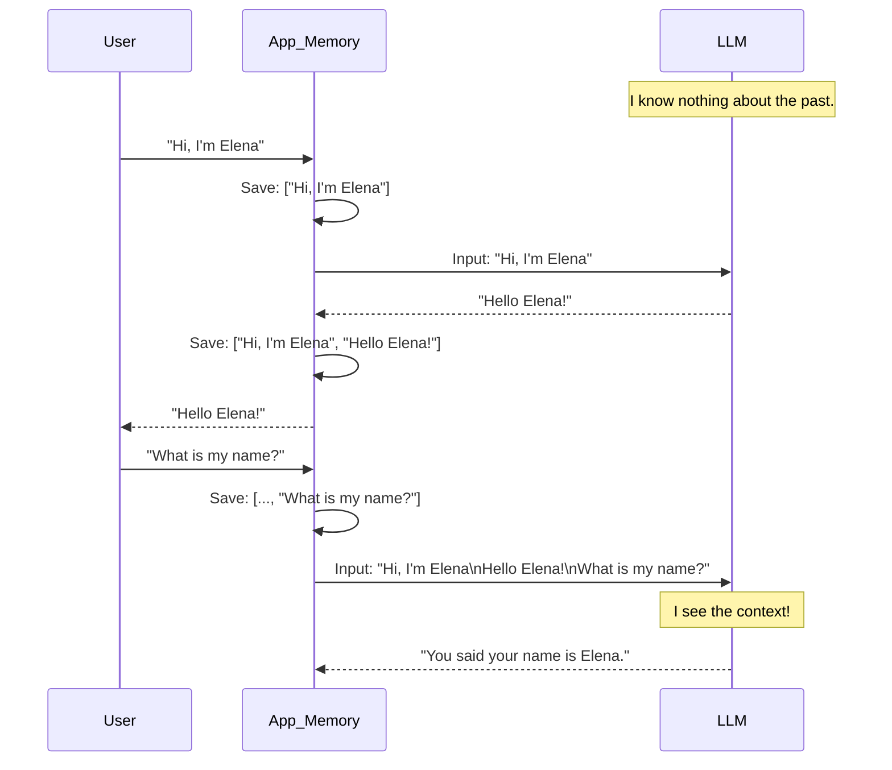

# Module 4: Memory (Week 4)

## Learning Objectives
*   **Understand why LLMs are stateless**: Grasp the fundamental nature of HTTP and LLM APIs.
*   **Implement `RunnableWithMessageHistory`**: Master the modern, robust way to add memory to chains.
*   **Use `ChatMessageHistory`**: Learn how to store and manage session data effectively.

## Prerequisites & Setup
Before we dive in, make sure you have your environment ready. We'll be using **Ollama** with `llama3.1` (or your preferred local model) and the latest LangChain v0.3 packages.

**Install necessary packages:**
```bash
pip install -qU langchain langchain-ollama langgraph
```

**Set up your environment:**
Ensure your `.env` file is loaded if you have any API keys, though for Ollama we mostly just need the server running.

```python
import os
from dotenv import load_dotenv

load_dotenv()
# If you were using OpenAI, you'd check for OPENAI_API_KEY here.
# For Ollama, just make sure 'ollama serve' is running in your terminal!
```

---

## Understand why LLMs are stateless

This is the "Aha!" moment for many developers.

Imagine you're meeting a friend, **Alice**, for coffee. You say, "Hi, I'm Elena." She says, "Nice to meet you, Elena!"
Five minutes later, you ask, "What's my name?"
If Alice were an LLM, she would look at you blankly and say, "I don't know. Who are you?"

**Why?** Because every time you send a request to an LLM, it's a **fresh start**. The model has no internal memory of your past requests. It doesn't "remember" you. It just predicts the next token based *only* on the input you just gave it.

### The "Stateless" Reality
In technical terms, LLMs are **stateless functions**.
`f(input) -> output`

If you want the model to "remember" the conversation, **YOU** (the developer) have to pass the entire conversation history back to the model with every new message.

**The Illusion of Memory:**
1.  **User**: "Hi, I'm Elena."
2.  **App**: Saves "User: Hi, I'm Elena." to a database.
3.  **User**: "What's my name?"
4.  **App**: Retrieves history. Sends: `[User: Hi, I'm Elena. AI: Nice to meet you. User: What's my name?]`
5.  **LLM**: Reads the whole transcript. Sees "I'm Elena". Responds: "Your name is Elena."

It looks like memory, but it's actually just **context**.

### Visualizing the Flow



---

## Implement `RunnableWithMessageHistory` (the modern way)

In the old days of LangChain (v0.1), we used `ConversationChain`. **Forget that.** It's deprecated.
The modern, LCEL-native way to add memory is `RunnableWithMessageHistory`. It's a wrapper that handles the "saving" and "loading" of messages for you automatically.

### What we're about to build
We will build a simple chat chain that uses `ChatOllama`. We'll wrap it so it can remember our name across multiple interactions.

### Imports explained
*   `ChatOllama`: Our local LLM interface.
*   `ChatPromptTemplate`, `MessagesPlaceholder`: To structure our prompt. `MessagesPlaceholder` is crucial—it's where the history will be injected.
*   `RunnableWithMessageHistory`: The magic wrapper that adds memory.
*   `ChatMessageHistory`: A simple in-memory storage for our messages (good for testing).

### The Code

```python
from langchain_ollama import ChatOllama
from langchain_core.prompts import ChatPromptTemplate, MessagesPlaceholder
from langchain_core.runnables.history import RunnableWithMessageHistory
from langchain_community.chat_message_histories import ChatMessageHistory
from langchain_core.chat_history import BaseChatMessageHistory

# 1. Define the Model
llm = ChatOllama(model="llama3.1")

# 2. Define the Prompt
# CRITICAL: You MUST include a placeholder for history!
prompt = ChatPromptTemplate.from_messages([
    ("system", "You are a helpful assistant. Answer all questions to the best of your ability."),
    MessagesPlaceholder(variable_name="chat_history"), # <--- History goes here
    ("human", "{input}"),
])

# 3. Create the Chain
chain = prompt | llm

# 4. Define a History Factory
# This function tells LangChain: "For a given session_id, where do I get the history?"
store = {}

def get_session_history(session_id: str) -> BaseChatMessageHistory:
    if session_id not in store:
        store[session_id] = ChatMessageHistory()
    return store[session_id]

# 5. Wrap the Chain with Memory
with_message_history = RunnableWithMessageHistory(
    chain,
    get_session_history,
    input_messages_key="input",
    history_messages_key="chat_history", # Must match the placeholder name above
)

# 6. Use it!
# Session A: Elena
config_a = {"configurable": {"session_id": "session_elena"}}

response_1 = with_message_history.invoke(
    {"input": "Hi, my name is Elena!"},
    config=config_a
)
print(f"Session A (1): {response_1.content}")

response_2 = with_message_history.invoke(
    {"input": "What is my name?"},
    config=config_a
)
print(f"Session A (2): {response_2.content}")

# Session B: Bob (New session, should not know Elena)
config_b = {"configurable": {"session_id": "session_bob"}}

response_3 = with_message_history.invoke(
    {"input": "What is my name?"},
    config=config_b
)
print(f"Session B (1): {response_3.content}")
```

### Expected output
```text
Session A (1): Nice to meet you, Elena! How can I help you today?
Session A (2): Your name is Elena, as you mentioned earlier.
Session B (1): I don't know your name yet. Would you like to tell me?
```

### Why this works — breakdown
1.  **`MessagesPlaceholder`**: This is a "slot" in your prompt. When the chain runs, LangChain looks for a variable named `chat_history` and dumps the list of past messages there.
2.  **`get_session_history`**: This function is the bridge. It checks the `session_id` you provided. If it's new, it creates a fresh empty list (`ChatMessageHistory`). If it exists, it returns the existing one.
3.  **`RunnableWithMessageHistory`**: This wrapper intercepts your `.invoke()`.
    *   **Before** calling the LLM: It calls `get_session_history`, loads the messages, and adds them to the input dictionary under `chat_history`.
    *   **After** the LLM responds: It takes your input ("Hi...") and the AI's response ("Nice to meet...") and saves them both back to the `ChatMessageHistory`.

---

## Use `ChatMessageHistory` to store session data

In the example above, we used a simple Python dictionary `store = {}`. This is fine for scripts, but if you restart your server, **poof**—memory is gone.

In production, you'd use a database (Redis, Postgres, etc.). But `ChatMessageHistory` is the building block. Let's look at how to manipulate it manually so you understand what's happening under the hood.

### What we're about to build
We will manually create a history object, add messages to it, and see how it formats them. This demystifies the "magic" of the previous section.

### Imports explained
*   `ChatMessageHistory`: The class that holds a list of messages.
*   `HumanMessage`, `AIMessage`: The actual message objects.

### The Code

```python
from langchain_community.chat_message_histories import ChatMessageHistory
from langchain_core.messages import HumanMessage, AIMessage

# 1. Create a history object
history = ChatMessageHistory()

# 2. Add messages manually
history.add_user_message("Hi, I'm learning LangChain!")
history.add_ai_message("That's awesome! It's a powerful framework.")

# 3. Inspect the messages
print("--- Current History ---")
print(history.messages)

# 4. Add another turn
history.add_user_message("What is the hardest part?")
history.add_ai_message("Probably understanding statelessness and memory!")

print("\n--- Updated History ---")
for msg in history.messages:
    print(f"{msg.type.upper()}: {msg.content}")
```

### Expected output
```text
--- Current History ---
[HumanMessage(content="Hi, I'm learning LangChain!"), AIMessage(content="That's awesome! It's a powerful framework.")]

--- Updated History ---
HUMAN: Hi, I'm learning LangChain!
AI: That's awesome! It's a powerful framework.
HUMAN: What is the hardest part?
AI: Probably understanding statelessness and memory!
```

### Why this works — breakdown
*   **`ChatMessageHistory`** acts as a list wrapper. It has convenient methods like `.add_user_message()` so you don't have to manually import `HumanMessage` every time.
*   When you use `RunnableWithMessageHistory` (from the previous section), it is calling these exact methods behind the scenes to save the conversation!

---

## Hands-on Exercise / Project

Now it's your turn. We're going to build the **"Context-Aware Chatbot"**.

**Goal**: Create a CLI (Command Line Interface) chatbot that:
1.  Runs in a `while` loop.
2.  Maintains your conversation history.
3.  Allows you to type "exit" to quit.
4.  Has a "reset" command to clear memory.

### The Code

```python
from langchain_ollama import ChatOllama
from langchain_core.prompts import ChatPromptTemplate, MessagesPlaceholder
from langchain_core.runnables.history import RunnableWithMessageHistory
from langchain_community.chat_message_histories import ChatMessageHistory
from langchain_core.chat_history import BaseChatMessageHistory

# --- Setup ---
llm = ChatOllama(model="llama3.1")

prompt = ChatPromptTemplate.from_messages([
    ("system", "You are a friendly companion. Keep answers concise."),
    MessagesPlaceholder(variable_name="history"),
    ("human", "{input}"),
])

chain = prompt | llm

# Store for memory
session_store = {}

def get_history(session_id: str) -> BaseChatMessageHistory:
    if session_id not in session_store:
        session_store[session_id] = ChatMessageHistory()
    return session_store[session_id]

# Wrap chain
conversation_chain = RunnableWithMessageHistory(
    chain,
    get_history,
    input_messages_key="input",
    history_messages_key="history"
)

# --- Main Loop ---
def run_chat():
    print("🤖 Context-Aware Chatbot (type 'exit' to quit, 'reset' to clear memory)")
    session_id = "user_1" # In a real app, this might be a user ID or cookie
    
    while True:
        user_input = input("\nYou: ")
        if user_input.lower() in ["exit", "quit"]:
            print("Goodbye!")
            break
        
        if user_input.lower() == "reset":
            if session_id in session_store:
                session_store[session_id].clear()
            print("🧹 Memory cleared!")
            continue

        # Stream the response for a better feel
        print("AI: ", end="", flush=True)
        config = {"configurable": {"session_id": session_id}}
        
        # We use .stream() here for that nice typing effect!
        for chunk in conversation_chain.stream({"input": user_input}, config=config):
            print(chunk.content, end="", flush=True)
        print() # Newline

if __name__ == "__main__":
    run_chat()
```

### Challenge for you
Try modifying the `session_id`. What happens if you hardcode it to a different string every time the loop runs? (Hint: The bot will get amnesia!)

---

## Quiz & Exercises

### Quiz
1.  **True or False**: LLMs inherently remember the last thing you said to them.
2.  Which component in the prompt is used to inject the list of past messages?
    a) `SystemMessage`
    b) `MessagesPlaceholder`
    c) `HumanMessage`
3.  If you restart your Python script, what happens to the memory stored in `ChatMessageHistory` (the way we used it)?

<details>
<summary>Click to reveal answers</summary>
1. <b>False</b>. They are stateless.
2. <b>b) MessagesPlaceholder</b>.
3. <b>It is lost</b>. It is stored in RAM. For persistence, you need a database-backed history (like RedisChatMessageHistory).
</details>

### Exercise: The "Summarizing" Memory
**Advanced Challenge**: Can you create a chain that, instead of storing *every* message, summarizes the conversation so far and only passes the summary to the LLM?
*Hint*: Look up `ConversationSummaryMemory` (legacy) or try to implement it manually using a second chain that summarizes the `ChatMessageHistory` before passing it to the main chain.

---

## Further Reading & Resources

*   **Official Docs on RunnableWithMessageHistory**: [LangChain How-To](https://python.langchain.com/docs/how_to/message_history/)
*   **LangSmith**: Once you build complex memory chains, use [LangSmith](https://smith.langchain.com/) to trace exactly what is being passed to the LLM. You'll see the full history being injected!
*   **Persistent Memory**: Want to save chats to a database? Check out `RedisChatMessageHistory` or `PostgresChatMessageHistory` in the `langchain-community` package.

You've crushed Module 4! Memory is a huge milestone. Next week, we'll dive into **RAG (Retrieval Augmented Generation)**, where we give the LLM access to *your* data, not just conversation history. See you there!
