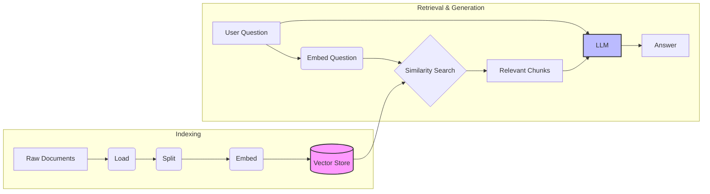
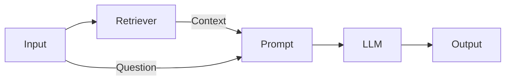

# Module 5: Retrieval Augmented Generation (RAG) (Week 5-6)

## Learning Objectives

By the end of this module, you will be able to:
*   **Explain RAG** from first principles: why LLMs need it and how it works.
*   **Load Documents** from various sources (text files, PDFs) using LangChain Loaders.
*   **Split Text** intelligently using `RecursiveCharacterTextSplitter` to preserve context.
*   **Generate Embeddings** using local models (`nomic-embed-text` via Ollama).
*   **Store & Retrieve** vectors using a local Vector Store (`Chroma`).
*   **Build a Complete RAG Chain** using LCEL to answer questions based on your own data.

## Prerequisites & Setup

Before we dive in, ensure you have your environment ready. We are moving into more complex territory, so having a solid foundation is key.

**1. Install Required Packages**
We need a few new libraries for this module: `langchain-chroma` for our vector store and `pypdf` for reading PDF files.

```bash
pip install langchain-chroma pypdf
```

**2. Pull the Embedding Model**
We will use `nomic-embed-text`, a fantastic, high-performance open-source embedding model that runs locally via Ollama.

```bash
ollama pull nomic-embed-text
```

**3. Verify Your Environment**
Ensure your `.env` file is set up (though for local Ollama, we often don't need API keys, it's good practice to have your environment ready).

---

## 1. RAG Concepts & Architecture

**The Problem:**
Imagine you're taking an exam.
*   **Standard LLM:** You have to answer purely from memory. You might hallucinate or just not know recent facts.
*   **RAG:** You are allowed to bring a textbook. When asked a question, you first *retrieve* the relevant page, *read* it, and *generate* the answer based on that information.

**Retrieval Augmented Generation (RAG)** is simply the process of giving an LLM access to private or up-to-date data that it wasn't trained on.

**The Architecture:**
Here is the flow of data in a RAG application. It happens in two phases: **Indexing** (preparing data) and **Retrieval & Generation** (answering questions).



1.  **Load**: Bring data in from PDFs, websites, databases.
2.  **Split**: Break large documents into smaller, digestible chunks.
3.  **Embed**: Turn text chunks into lists of numbers (vectors) that represent meaning.
4.  **Store**: Save these vectors in a database (Vector Store).
5.  **Retrieve**: When a user asks a question, find the chunks with the most similar vectors.
6.  **Generate**: Pass the question + relevant chunks to the LLM to write the answer.

---

## 2. Document Loaders

Data comes in many shapes. LangChain provides **Document Loaders** to handle almost any format.

### Loading a Simple Text File

**What we're about to build:**
We'll start simple: loading a basic `.txt` file. This is the "Hello World" of data ingestion.

**Imports explained:**
*   `TextLoader`: The specific class for loading plain text files.
*   `Document`: The core data structure in LangChain. It holds `page_content` (the text) and `metadata` (source, etc.).

```python
from langchain_community.document_loaders import TextLoader

# Create a dummy file for demonstration
with open("example.txt", "w") as f:
    f.write("LangChain was launched in October 2022 by Harrison Chase. It is a framework for building applications with LLMs.")

# 1. Initialize the loader
loader = TextLoader("./example.txt")

# 2. Load the documents
docs = loader.load()

print(f"Loaded {len(docs)} document(s)")
print(f"Content preview: {docs[0].page_content[:50]}...")
print(f"Metadata: {docs[0].metadata}")
```

**Expected output:**
```text
Loaded 1 document(s)
Content preview: LangChain was launched in October 2022 by Harrison...
Metadata: {'source': './example.txt'}
```

**Why this works — breakdown:**
*   `loader.load()` reads the file and returns a list of `Document` objects. Even though it's one file, it returns a list because some loaders (like directory loaders) return multiple documents.
*   The `metadata` automatically captures the source path, which is crucial for citing sources later!

### Loading a PDF

**What we're about to build:**
Real-world data is often in PDFs. Let's load one.

**Imports explained:**
*   `PyPDFLoader`: Uses the `pypdf` library under the hood to extract text from PDFs.

```python
from langchain_community.document_loaders import PyPDFLoader

# 1. Initialize loader with a path to a PDF
# (Make sure you have a dummy.pdf or change the path)
loader = PyPDFLoader("path/to/your/document.pdf") 

# 2. Load and split by page
pages = loader.load()

# print(f"Loaded {len(pages)} pages")
# print(f"Page 1 content: {pages[0].page_content[:100]}...")
```

> [!TIP]
> **Lazy Loading**: If you have a massive PDF, use `loader.lazy_load()` to iterate over pages one by one instead of loading everything into RAM at once.

---

## 3. Text Splitters

**The Problem:**
LLMs have a context window (e.g., 8k, 128k tokens). You can't just stuff a whole book in. Also, retrieving a whole book for one specific fact is inefficient. We need to break text into smaller, semantically meaningful chunks.

### Recursive Character Text Splitter

This is the **gold standard** for general text. It tries to split on paragraphs (`\n\n`), then sentences (`\n`), then spaces, keeping related text together.

**What we're about to build:**
We will take a long text and split it into chunks of ~100 characters, with some overlap to ensure we don't cut a sentence in half weirdly.

**Imports explained:**
*   `RecursiveCharacterTextSplitter`: The intelligent splitter that respects document structure.

```python
from langchain_text_splitters import RecursiveCharacterTextSplitter

long_text = """
LangChain is a framework for developing applications powered by language models.
It enables applications that:
1. Are context-aware: connect a language model to sources of context (prompt instructions, few shot examples, content to ground its response in, etc.)
2. Reason: rely on a language model to reason (about how to answer based on provided context, what actions to take, etc.)
This framework consists of several parts.
"""

# 1. Initialize the splitter
text_splitter = RecursiveCharacterTextSplitter(
    chunk_size=100,      # Target size of each chunk
    chunk_overlap=20,    # Overlap between chunks to preserve context
    length_function=len, # How to measure length (characters)
    is_separator_regex=False,
)

# 2. Split the text
chunks = text_splitter.create_documents([long_text])

print(f"Created {len(chunks)} chunks.")
for i, chunk in enumerate(chunks):
    print(f"Chunk {i}: {repr(chunk.page_content)}")
```

**Expected output:**
```text
Created 4 chunks.
Chunk 0: 'LangChain is a framework for developing applications powered by language models.\nIt enables'
Chunk 1: 'It enables applications that:\n1. Are context-aware: connect a language model to sources of context'
Chunk 2: '(prompt instructions, few shot examples, content to ground its response in, etc.)\n2. Reason: rely'
Chunk 3: 'on a language model to reason (about how to answer based on provided context, what actions to take,'
```

**Why this works — breakdown:**
*   **Chunk Size**: It tries to keep chunks around 100 characters.
*   **Overlap**: Notice "It enables" appears in Chunk 0 and Chunk 1? That's the overlap. It ensures that if a concept spans the cut, we don't lose the connection.

---

## 4. Embeddings

**The Magic:**
Embeddings turn text into numbers.
*   "Dog" -> `[0.1, 0.5, ...]`
*   "Puppy" -> `[0.12, 0.48, ...]` (Close to Dog)
*   "Car" -> `[0.9, -0.2, ...]` (Far from Dog)

We use these vectors to find "nearest neighbors" — text that means similar things.

**What we're about to build:**
We'll use Ollama to generate embeddings for a few words and see the vector dimensions.

**Imports explained:**
*   `OllamaEmbeddings`: The interface to call embedding models running in Ollama.

```python
from langchain_ollama import OllamaEmbeddings

# 1. Initialize the embedding model
embeddings = OllamaEmbeddings(
    model="nomic-embed-text", # A great open-source embedding model
)

text = "LangChain is awesome."

# 2. Generate embedding
vector = embeddings.embed_query(text)

print(f"Vector length: {len(vector)}")
print(f"First 5 dimensions: {vector[:5]}")
```

**Expected output:**
```text
Vector length: 768
First 5 dimensions: [-0.012, 0.045, -0.098, 0.001, 0.112]
```

**Why this works — breakdown:**
*   `nomic-embed-text` produces vectors of size 768. This is a standard size (BERT base size).
*   These numbers represent the *semantic meaning* of the sentence in a high-dimensional space.

---

## 5. Vector Stores

Now we have Documents -> Split -> Embeddings. We need a place to store them efficiently. Enter **Vector Stores**. We'll use **Chroma**, a popular open-source vector database that runs locally.

**What we're about to build:**
We will create a temporary, in-memory vector store, add our document chunks to it, and perform a similarity search.

**Imports explained:**
*   `Chroma`: The vector store implementation.
*   `Document`: To wrap our text if needed (though `from_texts` handles raw strings).

```python
from langchain_chroma import Chroma
from langchain_ollama import OllamaEmbeddings

# Data to index
documents = [
    "LangChain was founded by Harrison Chase.",
    "LangGraph is a library for building stateful, multi-actor applications with LLMs.",
    "Ollama allows you to run open-source LLMs locally.",
]

# 1. Initialize Embeddings
embeddings = OllamaEmbeddings(model="nomic-embed-text")

# 2. Create Vector Store (this performs Indexing: Embed -> Store)
vectorstore = Chroma.from_texts(
    texts=documents,
    embedding=embeddings,
    collection_name="example_collection" # Optional name
)

print("Vector store created and indexed.")

# 3. Perform a Similarity Search
query = "Who created LangChain?"
results = vectorstore.similarity_search(query, k=1) # k=1 means return top 1 result

print(f"\nQuery: {query}")
print(f"Result: {results[0].page_content}")
```

**Expected output:**
```text
Vector store created and indexed.

Query: Who created LangChain?
Result: LangChain was founded by Harrison Chase.
```

**Why this works — breakdown:**
*   `Chroma.from_texts`: This helper function takes a list of strings, calls the `embeddings` model for each one, and stores the resulting vectors in Chroma.
*   `similarity_search`: It embeds the `query` ("Who created LangChain?") and finds the vector in the store that is mathematically closest (using Cosine Similarity or Euclidean Distance).

---

## 6. Retrievers

A **Retriever** is an interface that returns Documents given an unstructured query. A Vector Store is a *type* of retriever, but there are others (keyword search, hybrid search).

In LangChain, we typically turn a Vector Store into a Retriever to use it in chains.

```python
# Turn our vectorstore into a retriever
retriever = vectorstore.as_retriever(
    search_type="similarity",
    search_kwargs={"k": 2} # Return top 2 results
)

# Test it
docs = retriever.invoke("What is LangGraph?")
for doc in docs:
    print(f"- {doc.page_content}")
```

---

## 7. Building a RAG Chain (LCEL)

This is the grand finale. We will combine everything into a production-ready RAG chain using LCEL.

**The Flow:**
1.  **Input**: User question.
2.  **Retrieve**: Fetch relevant context from Vector Store.
3.  **Prompt**: Insert context + question into a prompt template.
4.  **LLM**: Generate answer.
5.  **Output**: String response.



**What we're about to build:**
A complete chain that answers questions based on the documents we indexed earlier.

**Imports explained:**
*   `ChatPromptTemplate`: To structure our prompt.
*   `ChatOllama`: Our LLM.
*   `StrOutputParser`: To clean up the LLM response.
*   `RunnablePassthrough`: A magic utility that allows us to pass data through the chain unchanged (like passing the question to the prompt).

```python
from langchain_core.prompts import ChatPromptTemplate
from langchain_ollama import ChatOllama
from langchain_core.output_parsers import StrOutputParser
from langchain_core.runnables import RunnablePassthrough

# 1. Setup LLM
llm = ChatOllama(model="llama3.1")

# 2. Setup Prompt
# The prompt MUST have placeholders for 'context' and 'question'
template = """Answer the question based ONLY on the following context:
{context}

Question: {question}
"""
prompt = ChatPromptTemplate.from_template(template)

# 3. Define the Chain
def format_docs(docs):
    return "\n\n".join([d.page_content for d in docs])

rag_chain = (
    {"context": retriever | format_docs, "question": RunnablePassthrough()}
    | prompt
    | llm
    | StrOutputParser()
)

# 4. Run it!
response = rag_chain.invoke("What is LangGraph used for?")
print(response)
```

**Expected output:**
```text
LangGraph is a library for building stateful, multi-actor applications with LLMs.
```

**Why this works — breakdown:**
*   `{"context": retriever | format_docs, "question": RunnablePassthrough()}`: This is a **RunnableParallel**. It runs two branches in parallel:
    *   `context`: Takes the input (question), passes it to `retriever`, gets docs, and formats them as a string.
    *   `question`: `RunnablePassthrough()` simply takes the input (question) and passes it along.
*   The result is a dictionary `{'context': "...", 'question': "..."}` which matches the input expected by our `prompt`.
*   The `prompt` fills in the blanks, sends it to the `llm`, and `StrOutputParser` gives us the final string.

---

## Hands-on Project: "DocuChat" 📄💬

Let's build a script that lets you chat with any text file!

**Goal:** Create a script `docuchat.py` that loads a file, indexes it, and starts a chat loop.

**Step 1: Create `docuchat.py`**

```python
import os
import sys
from langchain_community.document_loaders import TextLoader
from langchain_text_splitters import RecursiveCharacterTextSplitter
from langchain_ollama import OllamaEmbeddings, ChatOllama
from langchain_chroma import Chroma
from langchain_core.prompts import ChatPromptTemplate
from langchain_core.output_parsers import StrOutputParser
from langchain_core.runnables import RunnablePassthrough

def main():
    # 1. Load Document
    file_path = "sample_data.txt" # Make sure this file exists!
    if not os.path.exists(file_path):
        with open(file_path, "w") as f:
            f.write("The capital of France is Paris. The Eiffel Tower is 330 meters tall.")
        print(f"Created dummy file: {file_path}")

    print(f"Loading {file_path}...")
    loader = TextLoader(file_path)
    docs = loader.load()

    # 2. Split Document
    text_splitter = RecursiveCharacterTextSplitter(chunk_size=500, chunk_overlap=50)
    splits = text_splitter.split_documents(docs)

    # 3. Embed & Store
    print("Indexing documents...")
    vectorstore = Chroma.from_documents(
        documents=splits,
        embedding=OllamaEmbeddings(model="nomic-embed-text"),
        collection_name="docuchat_collection"
    )
    retriever = vectorstore.as_retriever()

    # 4. RAG Chain
    llm = ChatOllama(model="llama3.1")
    template = """You are a helpful assistant. Use the following context to answer the question.
    If you don't know the answer, just say you don't know.
    
    Context: {context}
    
    Question: {question}
    """
    prompt = ChatPromptTemplate.from_template(template)
    
    def format_docs(docs):
        return "\n\n".join([d.page_content for d in docs])

    rag_chain = (
        {"context": retriever | format_docs, "question": RunnablePassthrough()}
        | prompt
        | llm
        | StrOutputParser()
    )

    # 5. Chat Loop
    print("\n--- DocuChat Ready! (Type 'exit' to quit) ---")
    while True:
        query = input("\nYou: ")
        if query.lower() in ["exit", "quit"]:
            break
        
        # Stream the response for a cool effect
        print("AI: ", end="", flush=True)
        for chunk in rag_chain.stream(query):
            print(chunk, end="", flush=True)
        print()

    # Cleanup (Optional: delete the vectorstore to save space)
    vectorstore.delete_collection()

if __name__ == "__main__":
    main()
```

**Challenge:** Modify this to accept a file path as a command-line argument!

---

## Quiz & Exercises

**Quiz:**
1.  What are the two main phases of a RAG pipeline?
2.  Why do we need to split text into chunks? Why not just embed the whole document?
3.  What is the role of `RunnablePassthrough` in a RAG chain?
4.  If your `chunk_overlap` is 0, what risk do you run?

**Exercise:**
*   **Level 1:** Run the "DocuChat" script with your own text file (e.g., a saved news article).
*   **Level 2:** Switch the `TextLoader` to `PyPDFLoader` and chat with a PDF resume or paper.
*   **Level 3:** Add a "Sources" section to the output. *Hint: The retriever returns documents with metadata. You'll need to modify the chain to return the source documents alongside the answer.*

---

## Further Reading & Resources

*   **Official RAG Tutorial**: [LangChain RAG Docs](https://python.langchain.com/docs/tutorials/rag/)
*   **Text Splitters**: [Deep dive into splitters](https://python.langchain.com/docs/concepts/#text-splitters)
*   **Vector Stores**: [Integrations](https://python.langchain.com/docs/integrations/vectorstores/)
*   **Ollama Models**: [Ollama Library](https://ollama.com/library)

**Next Week:** We will give our LLMs superpowers by teaching them to use **Tools** and become **Agents**! 🤖
