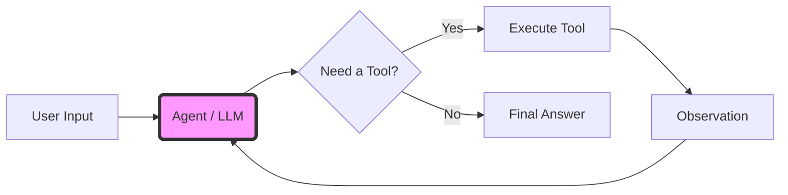

# Module 6: Agents & Tools (Week 7)

Welcome to **Module 6**! 🎓

If you've made it this far, you've already mastered the "body" of LangChain: Chains, Memory, and RAG. Now, we are going to give that body a **Brain**.

Up until now, your chains have been linear. Step A leads to Step B, which leads to Step C. It's like a train on a track—it can only go where the rails take it.

**Agents** change everything. An Agent is like an all-terrain vehicle with a GPS. You give it a destination ("Calculate the profit for Q3"), and *it* decides which path to take, which tools to use, and how to get there. It can loop, retry, and reason.

This is the most exciting part of AI engineering. Let's dive in!

---

## Learning Objectives

By the end of this module, you will be able to:

*   **Explain the Agent Architecture**: Understand how an LLM uses a "Thought-Action-Observation" loop to solve problems.
*   **Create Custom Tools**: Use the `@tool` decorator to give your agent super-powers (calculators, search engines, APIs).
*   **Bind Tools to Models**: Learn the low-level mechanics of `llm.bind_tools()` that make agents possible.
*   **Build a "Math Wizard" Agent**: Create an agent that can solve complex multi-step word problems.

---

## Prerequisites & Setup

We will need a few new packages for this module.

### 1. Environment Setup

Ensure your `.env` file is ready with your keys (though we will focus on local models via Ollama, the concepts apply universally).

```bash
pip install -qU langchain langchain-ollama langchain-core langgraph
```

### 2. The Mental Model: What is an Agent?

Imagine you are a chef.
*   **Chain**: A recipe. "Chop onions, then sauté, then add tomatoes." You follow instructions blindly.
*   **Agent**: A master chef. You have a goal ("Make something delicious with what's in the fridge"). You look at the ingredients (Observation), decide what to make (Thought), start cooking (Action), taste it (Observation), and adjust seasoning (Thought/Action).

In LangChain, the **LLM is the Brain**. It doesn't just generate text; it generates **decisions**.



---

## Concept of Agents (LLM as reasoning engine)

The core magic of an agent is the **ReAct Loop** (Reasoning + Acting).

1.  **Thought**: The LLM analyzes the user's request. "The user wants to know the square root of 144. I can't calculate that reliably, but I have a calculator tool."
2.  **Action**: The LLM generates a structured command to call the tool. `Calculator(144)`
3.  **Observation**: The tool runs and returns the result. `12`
4.  **Final Answer**: The LLM sees the result and answers the user. "The square root of 144 is 12."

This loop allows LLMs to overcome their biggest weaknesses: lack of real-time knowledge and poor math skills.

---

## Defining Tools (`@tool`)

Tools are the hands of your agent. Without tools, an agent is just a chatbot. A tool can be *anything*: a Python function, a Google Search, a database query, or a call to a weather API.

In LangChain, the easiest way to define a tool is using the `@tool` decorator.

### What we're about to build
We will create a simple custom tool that calculates the length of a word. This is a trivial example, but it proves that the LLM is actually calling our Python code.

### Imports explained
*   `tool`: The decorator that converts a standard Python function into a LangChain Tool.

```python
from langchain_core.tools import tool

@tool
def get_word_length(word: str) -> int:
    """Returns the length of a word."""
    return len(word)

# Let's inspect what the tool looks like
print(f"Tool Name: {get_word_length.name}")
print(f"Tool Description: {get_word_length.description}")
print(f"Tool Args: {get_word_length.args}")

# We can invoke it directly like a function
print(f"Direct Invocation: {get_word_length.invoke('LangChain')}")
```

### Expected output
```text
Tool Name: get_word_length
Tool Description: Returns the length of a word.
Tool Args: {'word': {'title': 'Word', 'type': 'string'}}
Direct Invocation: 9
```

### Why this works — breakdown
*   **`@tool`**: This decorator uses Python's `inspect` module to read your function's name, docstring, and type hints.
*   **Docstring is Critical**: The string `"""Returns the length of a word."""` is **NOT** for humans. It is the prompt that tells the LLM *when* to use this tool. If you write a bad description, the agent won't know how to use the tool.
*   **Type Hints**: `word: str` tells the LLM what kind of data to pass in.

> [!TIP]
> Always include type hints and a descriptive docstring for your tools. The LLM reads these to understand how to use the tool!

---

## Binding tools to models

Now that we have a tool, how does the LLM know about it? We "bind" the tool to the model. This uses the underlying "Function Calling" API of the model (supported by OpenAI, Anthropic, Mistral, and Llama 3 via Ollama).

### What we're about to build
We will take a `ChatOllama` model and bind our `get_word_length` tool to it. Then we will ask it a question that requires the tool, and see what it returns.

### Imports explained
*   `ChatOllama`: Our local LLM interface.

```python
from langchain_ollama import ChatOllama

# 1. Initialize the model (Llama 3.1 is great for tool calling)
llm = ChatOllama(model="llama3.1", temperature=0)

# 2. Bind the tool to the model
llm_with_tools = llm.bind_tools([get_word_length])

# 3. Ask a question that requires the tool
response = llm_with_tools.invoke("What is the length of the word 'Supercalifragilisticexpialidocious'?")

# 4. Inspect the response
print(f"Content: {response.content}")
print(f"Tool Calls: {response.tool_calls}")
```

### Expected output
```text
Content: 
Tool Calls: [{'name': 'get_word_length', 'args': {'word': 'Supercalifragilisticexpialidocious'}, 'id': 'call_...'}]
```

### Why this works — breakdown
*   **`bind_tools`**: This converts our Python function definition into a JSON schema that the model understands. It appends this schema to the system prompt (or uses the model's native API).
*   **Empty Content**: Notice `response.content` is empty! The model didn't answer the question. Instead, it decided to *call a tool*.
*   **`tool_calls`**: The model returned a structured object saying, "Hey, please run the tool named `get_word_length` with the argument `word='Super...'`."

> [!IMPORTANT]
> The LLM does **NOT** run the tool itself. It just *requests* that the tool be run. You (the developer) must execute the tool and feed the result back.

---

## Using `create_tool_calling_agent`

Manually handling the loop (Call LLM -> Parse Output -> Run Tool -> Feed back to LLM) is tedious. LangChain provides pre-built agent constructors to do this for us.

We will use `create_tool_calling_agent`, which is the standard factory for modern chat models.

### What we're about to build
We will build a complete agent that has access to two tools: `add` and `multiply`. We will then ask it a math question. We'll use `AgentExecutor` to run the loop.

> [!NOTE]
> `AgentExecutor` is the "classic" way to run agents. In Module 7, we will replace this with **LangGraph**, which is more powerful. But `AgentExecutor` is perfect for understanding the basics.

### Imports explained
*   `ChatPromptTemplate`: To structure the conversation.
*   `create_tool_calling_agent`: The factory function that assembles the "Brain".
*   `AgentExecutor`: The runtime that executes the "Brain" and handles the tool execution loop.

```python
from langchain_core.prompts import ChatPromptTemplate
from langchain.agents import create_tool_calling_agent, AgentExecutor

# 1. Define some basic math tools
@tool
def add(a: int, b: int) -> int:
    """Adds two numbers."""
    return a + b

@tool
def multiply(a: int, b: int) -> int:
    """Multiplies two numbers."""
    return a * b

tools = [add, multiply]

# 2. Create the Prompt
# We need a placeholder for "agent_scratchpad" - this is where the agent's internal monologue (history of tool calls) goes.
prompt = ChatPromptTemplate.from_messages([
    ("system", "You are a helpful mathematical assistant."),
    ("human", "{input}"),
    ("placeholder", "{agent_scratchpad}"),
])

# 3. Create the Agent (The Brain)
agent = create_tool_calling_agent(llm, tools, prompt)

# 4. Create the Executor (The Body)
agent_executor = AgentExecutor(agent=agent, tools=tools, verbose=True)

# 5. Run it!
agent_executor.invoke({"input": "What is 3 times 5 plus 10?"})
```

### Expected output
```text
> Entering new AgentExecutor chain...

Invoking: `multiply` with `{'a': 3, 'b': 5}`

15

Invoking: `add` with `{'a': 15, 'b': 10}`

25

The result of 3 times 5 plus 10 is 25.

> Finished chain.
```

### Why this works — breakdown
1.  **The Prompt**: The user asks "What is 3 times 5 plus 10?".
2.  **First Pass**: The Agent sees the input. It reasons: "I need to multiply 3 and 5 first." It outputs a tool call: `multiply(3, 5)`.
3.  **Execution**: The `AgentExecutor` detects the tool call, runs the `multiply` Python function, and gets `15`.
4.  **Second Pass**: The `AgentExecutor` feeds the result `15` back to the Agent. The context now looks like:
    *   User: "3 * 5 + 10?"
    *   AI: Call `multiply(3, 5)`
    *   Tool: `15`
5.  **Reasoning**: The Agent sees the `15`. It reasons: "Now I need to add 10 to that result." It outputs: `add(15, 10)`.
6.  **Execution**: `AgentExecutor` runs `add`, gets `25`.
7.  **Final Pass**: The Agent sees `25`. It reasons: "I have the final answer." It outputs: "The result is 25."

---

## Hands-on Exercise / Project: "Math Wizard" 🧙‍♂️

Let's build something slightly more complex. A "Math Wizard" that can handle word problems and even check the length of your name.

### Goal
Create an agent with three tools:
1.  `get_word_length`: To count letters.
2.  `power`: To calculate exponents (e.g., 2 to the power of 3).
3.  `reverse_word`: To reverse a string.

### Step 1: Define the Tools

```python
@tool
def get_word_length(word: str) -> int:
    """Returns the length of a word."""
    return len(word)

@tool
def power(base: int, exponent: int) -> int:
    """Calculates the base to the power of the exponent."""
    return base ** exponent

@tool
def reverse_word(word: str) -> str:
    """Reverses a given word."""
    return word[::-1]

tools = [get_word_length, power, reverse_word]
```

### Step 2: Initialize Model & Agent

```python
from langchain_ollama import ChatOllama
from langchain.agents import create_tool_calling_agent, AgentExecutor
from langchain_core.prompts import ChatPromptTemplate

llm = ChatOllama(model="llama3.1", temperature=0)

prompt = ChatPromptTemplate.from_messages([
    ("system", "You are a Math Wizard. Use your tools to solve puzzles."),
    ("human", "{input}"),
    ("placeholder", "{agent_scratchpad}"),
])

agent = create_tool_calling_agent(llm, tools, prompt)
agent_executor = AgentExecutor(agent=agent, tools=tools, verbose=True)
```

### Step 3: Run the Wizard

```python
question = "Take the length of the word 'magic', square it, and then tell me the reverse of the word 'wizard'."

response = agent_executor.invoke({"input": question})
print(response["output"])
```

### Expected Flow
1.  Call `get_word_length('magic')` -> Returns `5`.
2.  Call `power(5, 2)` -> Returns `25`.
3.  Call `reverse_word('wizard')` -> Returns `'draziw'`.
4.  Final Answer: "The square of the length of 'magic' is 25, and 'wizard' reversed is 'draziw'."

---

## Quiz & Exercises

### Quiz
1.  **What is the difference between an Agent and a Chain?**
2.  **What does the `@tool` decorator do?**
3.  **Why do we need `bind_tools`?**
4.  **What is the `agent_scratchpad` in the prompt?**

### Exercise: The "Weather & Time" Agent
1.  Create a mock tool `get_weather(city: str)` that returns a fake weather report (e.g., "Sunny, 25C").
2.  Create a tool `get_current_time()` that returns the current system time using Python's `datetime`.
3.  Build an agent that can answer: "What is the weather in Tokyo and what time is it right now?"

---

## Further Reading & Resources

*   [LangChain Tool Calling Guide](https://python.langchain.com/docs/how_to/tool_calling/)
*   [Defining Custom Tools](https://python.langchain.com/docs/how_to/custom_tools/)
*   [Agent Types](https://python.langchain.com/docs/concepts/#agents)

**Next Week:** We will take this to the next level with **LangGraph** (Module 7). We will learn how to build stateful, multi-actor agents that can remember things over long periods and handle complex workflows that `AgentExecutor` can't touch. See you there! 👋
