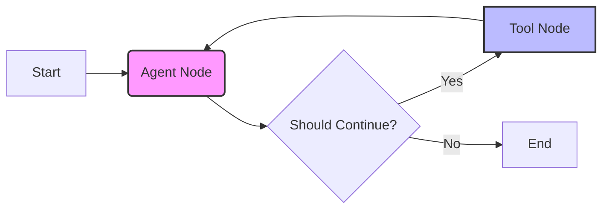

# Module 7: LangGraph (Week 8-9)

## Learning Objectives

By the end of this module, you will be able to:

*   **Explain *why* we are moving from `AgentExecutor` to `LangGraph`** (and why it's a game-changer for control).
*   **Master the core triad**: `StateGraph`, `Nodes`, and `Edges`.
*   **Build a ReAct Agent from scratch** without using the pre-built `create_react_agent` helper (so you understand the magic).
*   **Debug and visualize** your agent's thought process using LangSmith.

## Prerequisites & Setup

*   **Python Knowledge**: You should be comfortable with Python dictionaries (`TypedDict` specifically) and basic functions.
*   **Previous Modules**: You must understand what a **Tool** is (Module 6) and what a **Chain** is (Module 3).
*   **Environment**: Ensure you have your `.env` file set up with your API keys (OpenAI or Anthropic recommended for best agent performance, but Ollama works too!).

**Install the necessary packages:**

```bash
pip install -U langgraph langchain-openai langchain-community
```

---

## Move from `AgentExecutor` (legacy) to `LangGraph` (modern)

### The "Black Box" Problem

In Module 6, we used `AgentExecutor`. It was great for getting started quickly. You gave it tools, an LLM, and a prompt, and it just... worked.

But what happened when it *didn't* work? What if it got stuck in a loop? What if you wanted it to ask a human for permission before deleting a file?

`AgentExecutor` is like a **self-driving car where the steering wheel is locked inside a safe**. You can tell it where to go, but you can't grab the wheel if it starts driving off a cliff.

### Enter LangGraph

**LangGraph** is the new standard. It treats your agent not as a magical black box, but as a **Graph**.

Think of a flow chart.
*   **Nodes** are steps (like "Call LLM" or "Run Tool").
*   **Edges** are the lines connecting them.
*   **State** is the clipboard that gets passed around from node to node.

This gives you **total control**. You can create loops, conditional branches ("If error, go here; else, go there"), and even human-in-the-loop approval steps.



---

## `StateGraph`, `Nodes`, `Edges`

Let's break down the three pillars of LangGraph. This is the most important mental shift you'll make.

### 1. The State (`TypedDict`)

The **State** is the memory of your graph. It's a Python dictionary that holds all the information your agent needs to know right now. Every node receives this state, modifies it, and passes it on.

### 2. The Nodes (Functions)

A **Node** is just a regular Python function. It takes the current `State` as input and returns a dictionary with *updates* to that state.

### 3. The Edges (Logic)

**Edges** define the flow.
*   **Normal Edge**: "After Node A, always go to Node B."
*   **Conditional Edge**: "After Node A, check the state. If X, go to Node B. If Y, go to Node C."

### Example: The "Hello World" of Graphs

#### What we're about to build
We will build a simple graph with two nodes. Node 1 adds "Hello" to the state. Node 2 adds "World" to the state. Simple, but it proves the concept.

#### Imports explained
*   `TypedDict`: Standard Python type hinting. Used to define the structure of our State.
*   `StateGraph`: The main class for building our graph.
*   `END`: A special constant that tells the graph "We are done, stop running."

```python
from typing import TypedDict
from langgraph.graph import StateGraph, END

# 1. Define the State
class MyState(TypedDict):
    message: str
    count: int

# 2. Define the Nodes
def node_hello(state: MyState):
    print("--- Node Hello ---")
    # We return ONLY what we want to update.
    # The graph engine handles merging this with the existing state.
    return {"message": "Hello", "count": state.get("count", 0) + 1}

def node_world(state: MyState):
    print("--- Node World ---")
    old_message = state["message"]
    return {"message": f"{old_message} World", "count": state["count"] + 1}

# 3. Build the Graph
builder = StateGraph(MyState)

# Add nodes to the graph
builder.add_node("hello_node", node_hello)
builder.add_node("world_node", node_world)

# Add edges (the flow)
# Start -> hello_node -> world_node -> END
builder.set_entry_point("hello_node")
builder.add_edge("hello_node", "world_node")
builder.add_edge("world_node", END)

# 4. Compile the Graph
graph = builder.compile()

# 5. Run it!
initial_state = {"count": 0}
result = graph.invoke(initial_state)

print(f"\nFinal Result: {result}")
```

#### Expected output
```text
--- Node Hello ---
--- Node World ---

Final Result: {'message': 'Hello World', 'count': 2}
```

#### Why this works — breakdown
1.  **`StateGraph(MyState)`**: We initialized a graph that knows its state must look like `MyState`.
2.  **`add_node`**: We registered our two functions. Note that we gave them string names ("hello_node").
3.  **`set_entry_point`**: We told the graph, "When you start, jump straight to 'hello_node'".
4.  **`add_edge`**: We created a hard link. After `hello_node` finishes, the state is automatically passed to `world_node`.
5.  **`compile()`**: This freezes the graph structure and makes it runnable.
6.  **`invoke`**: We kicked it off. The state flowed through the nodes, accumulating changes.

---

## Building a ReAct Agent from scratch

Now for the real magic. We are going to build an agent that can **reason** and **act**.

A ReAct agent follows a loop:
1.  **Call LLM**: Ask the model what to do.
2.  **Check**: Did the model ask to call a tool?
3.  **Act**: If yes, run the tool and feed the output back to the LLM.
4.  **Repeat**: Go back to step 1.
5.  **End**: If the model didn't ask for a tool, return the final answer.

### Step 1: Define Tools and Model

#### What we're about to build
We'll set up a basic `multiply` tool and bind it to an OpenAI model.

#### Imports explained
*   `tool`: Decorator to turn a function into a LangChain tool.
*   `ChatOpenAI`: Our LLM. (You can use `ChatOllama` here too!).

```python
import os
from langchain_core.tools import tool
from langchain_openai import ChatOpenAI

# Set your key (or use .env)
# os.environ["OPENAI_API_KEY"] = "sk-..."

@tool
def multiply(a: int, b: int) -> int:
    """Multiplies two integers."""
    return a * b

# Initialize model and bind tools
llm = ChatOpenAI(model="gpt-4o-mini")
llm_with_tools = llm.bind_tools([multiply])
```

### Step 2: The Graph Logic

#### What we're about to build
We need a state that holds a list of messages. This is crucial because the LLM needs to see the entire conversation history (User request -> LLM thought -> Tool Output) to make the next decision.

#### Imports explained
*   `Annotated`: Used to tell LangGraph *how* to update the state.
*   `add_messages`: A special reducer function. It tells LangGraph, "When a node returns new messages, **append** them to the list, don't overwrite the whole list."
*   `ToolNode`: A pre-built node from LangGraph that runs tools for us! (Saves us writing a function to parse tool calls).

```python
from typing import Annotated, Literal, TypedDict
from langgraph.graph import StateGraph, END
from langgraph.graph.message import add_messages
from langgraph.prebuilt import ToolNode

# 1. Define State
class AgentState(TypedDict):
    # The 'messages' key will hold a list of BaseMessage objects.
    # Annotated[list, add_messages] means: "When new messages come in, ADD them to this list."
    messages: Annotated[list, add_messages]

# 2. Define Nodes

def chatbot_node(state: AgentState):
    # This node just calls the LLM
    return {"messages": [llm_with_tools.invoke(state["messages"])]}

# We use the prebuilt ToolNode for the "action" step
tool_node = ToolNode(tools=[multiply])

# 3. Define Conditional Logic (The "Brain")
def should_continue(state: AgentState) -> Literal["tools", "__end__"]:
    messages = state["messages"]
    last_message = messages[-1]
    
    # If the LLM made a tool call, go to the "tools" node
    if last_message.tool_calls:
        return "tools"
    
    # Otherwise, we are done
    return "__end__"

# 4. Build Graph
workflow = StateGraph(AgentState)

workflow.add_node("agent", chatbot_node)
workflow.add_node("tools", tool_node)

workflow.set_entry_point("agent")

# Conditional Edge: After "agent", run "should_continue" to decide where to go
workflow.add_conditional_edges(
    "agent",
    should_continue,
)

# Normal Edge: After "tools" run, ALWAYS go back to "agent" (to process the tool output)
workflow.add_edge("tools", "agent")

app = workflow.compile()
```

### Step 3: Running the Agent

#### What we're about to build
We'll ask the agent a math question. Watch how it loops!

```python
from langchain_core.messages import HumanMessage

final_state = app.invoke(
    {"messages": [HumanMessage(content="What is 123 times 45?")]}
)

# Let's print the message history to see the steps
for msg in final_state["messages"]:
    print(f"Type: {type(msg).__name__}")
    print(f"Content: {msg.content}")
    if hasattr(msg, 'tool_calls') and msg.tool_calls:
        print(f"Tool Calls: {msg.tool_calls}")
    print("-" * 20)
```

#### Expected output
```text
Type: HumanMessage
Content: What is 123 times 45?
--------------------
Type: AIMessage
Content: 
Tool Calls: [{'name': 'multiply', 'args': {'a': 123, 'b': 45}, 'id': 'call_...'}]
--------------------
Type: ToolMessage
Content: 5535
--------------------
Type: AIMessage
Content: 123 times 45 is 5,535.
--------------------
```

#### Why this works — breakdown
1.  **Entry**: The graph started at `agent`. The LLM saw "What is 123 * 45?" and decided it needed the `multiply` tool. It returned an `AIMessage` with a `tool_call`.
2.  **Conditional Edge**: `should_continue` looked at that `AIMessage`. It saw `tool_calls` was not empty, so it returned `"tools"`.
3.  **Tool Node**: The graph moved to `tools`. The `ToolNode` automatically executed `multiply(123, 45)` and returned a `ToolMessage` with the result `5535`.
4.  **Loop Back**: The edge `workflow.add_edge("tools", "agent")` sent us back to the LLM.
5.  **Final Pass**: The LLM now saw the whole history:
    *   Human: "Calculate..."
    *   AI: "I'll use multiply..."
    *   Tool: "5535"
    It realized it had the answer, so it generated a final text response.
6.  **Exit**: `should_continue` saw no tool calls this time, so it returned `"__end__"`.

---

## Hands-on Exercise: The "Agentic Researcher"

**Goal**: Build an agent that can search the web (we'll simulate this tool) and summarize findings.

**Step 1: Define the Search Tool**

```python
@tool
def search_web(query: str) -> str:
    """Simulates a web search engine."""
    # In a real app, you'd use Tavily or DuckDuckGo here
    if "weather" in query.lower():
        return "It is sunny and 25 degrees Celsius in New York."
    elif "langgraph" in query.lower():
        return "LangGraph is a library for building stateful, multi-actor applications with LLMs."
    return "No results found."
```

**Step 2: Build the Graph**

Use the exact same structure as the ReAct agent above, but:
1.  Bind the `search_web` tool instead of `multiply`.
2.  Give the LLM a system prompt to give it a persona.

```python
from langchain_core.prompts import ChatPromptTemplate, MessagesPlaceholder

# Create a prompt template
prompt = ChatPromptTemplate.from_messages([
    ("system", "You are a helpful research assistant. Use the search tool to find information."),
    MessagesPlaceholder(variable_name="messages"),
])

# Update the chatbot node to use the prompt
def chatbot_node(state: AgentState):
    chain = prompt | llm.bind_tools([search_web])
    return {"messages": [chain.invoke(state["messages"])]}
```

**Step 3: Run it**

Ask it: *"What is LangGraph?"* and verify it calls the tool and summarizes the fake result.

---

## Quiz & Exercises

1.  **Concept Check**: In a `StateGraph`, what happens if you have two nodes that both return `{"count": 1}`? Does the state become `{"count": 1}` or `{"count": 2}`? (Hint: It depends on how you defined the `TypedDict`! Did you use a reducer like `add_messages` or just a plain `int`?)
2.  **Debugging**: If your agent gets stuck in a loop calling the same tool over and over, which part of the graph logic should you check?
3.  **Challenge**: Modify the "Hello World" graph to add a conditional edge. If `count` is less than 3, go back to `hello_node`. If it's 3 or more, go to `END`.

---

## Further Reading & Resources

*   **Official LangGraph Tutorial**: [https://langchain-ai.github.io/langgraph/tutorials/introduction/](https://langchain-ai.github.io/langgraph/tutorials/introduction/)
*   **LangSmith Tracing**: [https://smith.langchain.com/](https://smith.langchain.com/) - Essential for visualizing your graphs.
*   **LangChain Concepts**: [https://python.langchain.com/docs/concepts/](https://python.langchain.com/docs/concepts/)

> [!TIP]
> **Pro Tip**: Always draw your graph on a piece of paper (or whiteboard) before you start coding. If you can't draw the circles and arrows, you can't code the graph!
