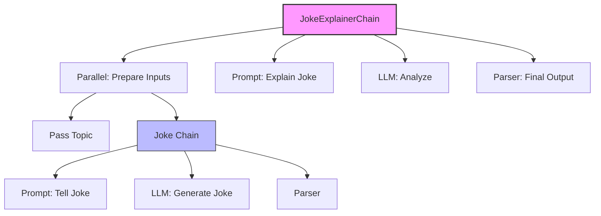

# Module 8: Evaluation & LangSmith (Week 10)

## Learning Objectives

By the end of this module, you will be able to:
*   **Understand the "Black Box" Problem**: Why building LLM apps is easy, but making them reliable is hard.
*   **Master LangSmith Tracing**: See exactly what's happening inside your chains and agents (inputs, outputs, latency, token usage).
*   **Create Datasets**: Build a "golden set" of examples to test your application against.
*   **Run Automated Evaluations**: Use an LLM-as-a-judge to score your application's performance systematically.

## Prerequisites & Setup

You should have completed Modules 1-7. We will be using the RAG concepts from Module 5 and the Agent concepts from Module 6/7 to test our evaluations.

**Environment Checklist:**
*   Python 3.11+
*   `langchain`, `langchain-openai` (or `langchain-ollama`), `langsmith` installed.
*   A LangSmith account (we'll set this up together).

**Installation:**
```bash
pip install -qU langchain langchain-openai langchain-community langsmith
```

---

## Setting up LangSmith (Free Tier)

Welcome to Week 10! You've built chatbots, RAG systems, and even autonomous agents. You're doing incredible work. But let me ask you a question: **How do you know if your bot is actually good?**

If you change your prompt, does it get better or worse? If you switch from Llama 3 to GPT-4o, is it worth the cost?

Until now, you've probably been "vibe checking" — running a few queries and saying, "Yeah, looks okay." That stops today. Today we become **AI Engineers**. We use data, tracing, and evaluation.

Enter **LangSmith**. It's the observability platform from the creators of LangChain. It lets you debug, test, and monitor your LLM apps.

### Step 1: Get your API Key
1.  Go to [smith.langchain.com](https://smith.langchain.com/) and sign up (it's free for individuals).
2.  On the bottom left, click the **Settings** (gear icon).
3.  Go to **API Keys** -> **Create API Key**.
4.  Copy it immediately.

### Step 2: Configure your Environment
We need to set three environment variables to turn on the magic.

**What we're about to build**: A simple script that configures LangSmith tracing so every run is automatically logged to the cloud.

**Imports explained**:
*   `os`: To set environment variables programmatically (though usually you'd put these in a `.env` file).
*   `ChatOpenAI`: Our standard model to test the tracing.

```python
import os
from langchain_openai import ChatOpenAI

# 1. Connect to LangSmith
os.environ["LANGCHAIN_TRACING_V2"] = "true"
os.environ["LANGCHAIN_API_KEY"] = "lsv2_..." # Your key here
os.environ["LANGCHAIN_PROJECT"] = "Module-8-Learning" # Optional: organize runs by project

# 2. Set up your model (using OpenAI for this example, but Ollama works too!)
os.environ["OPENAI_API_KEY"] = "sk-..." 

llm = ChatOpenAI(model="gpt-4o-mini")

# 3. Run a simple invocation
response = llm.invoke("Hello, LangSmith! How are you?")

print(response.content)
```

**Expected output**:
```text
Hello! I'm just a computer program, so I don't have feelings, but I'm functioning perfectly. How can I help you today?
```

**Why this works — breakdown**:
*   `LANGCHAIN_TRACING_V2="true"`: This is the master switch. As soon as this is set, LangChain starts sending data to LangSmith in the background.
*   `LANGCHAIN_PROJECT`: This groups your runs. If you go to the LangSmith UI now, you'll see a project named "Module-8-Learning".
*   **The Magic**: You didn't change a single line of your actual code. Just setting the env vars enabled full observability.

> [!TIP]
> **Pro Tip**: If you are using `ChatOllama`, tracing works exactly the same way! LangSmith doesn't care which model you use; it traces the *LangChain objects*.

---

## Tracing chains and agents

Tracing is like an X-ray for your application. When you have a complex chain (Prompt -> LLM -> OutputParser) or an Agent (Loop -> Tool -> LLM -> Tool), "vibe checking" the final output hides all the internal logic.

Did the retrieval step fail? Did the agent hallucinate a tool input? Tracing tells you.

### Visualizing a Chain Trace

Let's build a chain that's slightly complex so we can see a beautiful trace.

**What we're about to build**: A "Joke Generator" chain that takes a topic, generates a joke, and then explains why it's funny. This has two distinct LLM calls.

**Imports explained**:
*   `ChatPromptTemplate`: To structure our requests.
*   `StrOutputParser`: To clean up the LLM output.
*   `RunnablePassthrough`: To pass data through the chain without modifying it.

```python
from langchain_core.prompts import ChatPromptTemplate
from langchain_core.output_parsers import StrOutputParser
from langchain_core.runnables import RunnablePassthrough

# Define the model
model = ChatOpenAI(model="gpt-4o-mini")

# Step 1: Generate a joke
joke_prompt = ChatPromptTemplate.from_template(
    "Tell me a short, punchy joke about {topic}."
)
joke_chain = joke_prompt | model | StrOutputParser()

# Step 2: Explain the joke
# We want to pass the ORIGINAL topic AND the GENERATED joke to the next step
explanation_prompt = ChatPromptTemplate.from_template(
    """
    You are a comedy critic.
    Topic: {topic}
    Joke: {joke}
    
    Explain briefly why this joke is funny (or not).
    """
)

# The Full Chain
# We use a dictionary to map inputs for the second chain
final_chain = (
    {"topic": RunnablePassthrough(), "joke": joke_chain} 
    | explanation_prompt 
    | model 
    | StrOutputParser()
)

# Run it!
# We use .with_config to name the run in LangSmith
result = final_chain.with_config(run_name="JokeExplainerChain").invoke("Quantum Physics")

print(f"Final Result:\n{result}")
```

**Expected output**:
```text
Final Result:
The joke plays on the Heisenberg Uncertainty Principle... (explanation follows)
```

**Why this works — breakdown**:
*   **The Trace**: If you look at LangSmith now, you will see a root run called `JokeExplainerChain`.
*   **Drilling Down**: Click on it. You will see it expand into children. You'll see the parallel execution where `joke_chain` ran first to populate the `"joke"` key, while `RunnablePassthrough` passed the `"topic"`.
*   **Latency & Tokens**: You can see exactly how long the "Joke Generation" step took vs. the "Explanation" step. This is critical for performance tuning.

### Mermaid Diagram: The Trace Structure



---

## Creating datasets and running evaluations

Tracing is great for debugging *one* run. But how do we know if our app is working generally? We need **Evaluation**.

Evaluation consists of three parts:
1.  **Dataset**: A list of inputs (and optionally expected outputs).
2.  **Evaluator**: A function (or LLM) that scores the result.
3.  **Runner**: The engine that runs your app over the dataset and applies the evaluator.

### Step 1: Create a Dataset in LangSmith

You can do this in the UI, but let's do it in Python. It's more reproducible.

**What we're about to build**: A dataset of "General Knowledge" questions to test a simple QA bot.

**Imports explained**:
*   `Client`: The LangSmith client to interact with the API.

```python
from langsmith import Client

client = Client()

dataset_name = "General Knowledge 101"

# 1. Create the dataset
if not client.has_dataset(dataset_name=dataset_name):
    dataset = client.create_dataset(
        dataset_name=dataset_name,
        description="A simple dataset for testing QA bots",
    )
    
    # 2. Add examples
    client.create_examples(
        inputs=[
            {"question": "What is the capital of France?"},
            {"question": "Who wrote Romeo and Juliet?"},
            {"question": "What is the boiling point of water?"},
        ],
        outputs=[
            {"answer": "Paris"},
            {"answer": "William Shakespeare"},
            {"answer": "100 degrees Celsius"},
        ],
        dataset_id=dataset.id,
    )
    print("Dataset created!")
else:
    print("Dataset already exists.")
```

**Expected output**:
```text
Dataset created!
```

**Why this works — breakdown**:
*   `client.create_dataset`: Creates a container for our examples.
*   `client.create_examples`: Uploads the data. We provide `inputs` (what goes into the chain) and `outputs` (the ground truth or "reference" answer).

### Step 2: Define your Application

We need a target to test. Let's make a simple QA chain.

```python
# A simple chain to test
qa_prompt = ChatPromptTemplate.from_template("Answer this question briefly: {question}")
qa_chain = qa_prompt | model | StrOutputParser()
```

### Step 3: Run Evaluation (The "LLM-as-a-Judge")

This is the coolest part. We will use an LLM to grade another LLM. We'll use the built-in `LangChainStringEvaluator` to check for "correctness" by comparing the prediction to the reference answer.

**What we're about to build**: An evaluation script that runs our `qa_chain` against the dataset we just created and scores it.

**Imports explained**:
*   `evaluate`: The function that orchestrates the test.
*   `LangChainStringEvaluator`: A pre-built evaluator that uses an LLM to grade text.

```python
from langsmith.evaluation import evaluate, LangChainStringEvaluator

# 1. Define the evaluator
# "cot_qa" stands for "Chain of Thought QA" - it asks the judge to reason before grading.
qa_evaluator = LangChainStringEvaluator("cot_qa")

# 2. Define a wrapper function
# The evaluate function expects a function that takes inputs and returns a dict
def predict(inputs: dict):
    return qa_chain.invoke(inputs["question"])

# 3. Run the evaluation
results = evaluate(
    predict,
    data=dataset_name,
    evaluators=[qa_evaluator],
    experiment_prefix="test-gpt-4o-mini",
    metadata={"version": "1.0.0"}
)
```

**Expected output**:
```text
View the evaluation results for experiment: 'test-gpt-4o-mini-...' at:
https://smith.langchain.com/o/.../datasets/...
```

**Why this works — breakdown**:
*   `evaluate()`: This function iterates through every example in your dataset.
*   It calls your `predict` function with the input (e.g., "What is the capital of France?").
*   It gets the result ("Paris").
*   It passes the Input, Prediction, and Reference Answer to the `qa_evaluator`.
*   The Evaluator (an LLM) looks at it and says: "The prediction 'Paris' matches the reference 'Paris'. Correct."
*   It logs the score to LangSmith.

> [!IMPORTANT]
> **Click that link!** The output provides a URL. Click it to see a table of every run, the score it got, and the reasoning. This is the dashboard of a professional AI Engineer.

---

## Hands-on Exercise / Project: The "Eval Suite"

It's time for your mini-project. You are going to build a rigorous evaluation pipeline for a RAG system.

### The Scenario
You have a RAG app (simulated here) that answers questions about Python. You want to ensure it doesn't hallucinate.

### The Task
1.  **Create a Dataset**: Make a dataset named "Python-Facts" with 5 tricky questions about Python (e.g., "Is Python pass-by-reference?", "What is the GIL?"). Include the correct answers.
2.  **Build the System**: Create a simple chain (you can mock the RAG part with a prompt that has context injected).
3.  **Run Custom Eval**: Instead of just "correctness", I want you to use a **Custom Evaluator**.

### Code Solution

Here is the complete code for a custom evaluator that checks for **conciseness**. We want our bot to be brief!

```python
from langsmith.schemas import Run, Example
from langsmith.evaluation import evaluate

# 1. The System (Verbose Bot)
# We purposely make it verbose to see if it fails our eval
def verbose_bot(inputs: dict):
    return "Well, that is a very interesting question. To answer it, I would say that the answer is likely " + inputs["answer_hint"]

# 2. The Custom Evaluator
# Evaluators can be simple Python functions!
def conciseness_evaluator(run: Run, example: Example) -> dict:
    # Get the model's output
    prediction = run.outputs.get("output", "")
    
    # Simple logic: if it's too long, it fails
    score = 1 if len(prediction) < 50 else 0
    
    return {"key": "is_concise", "score": score}

# 3. The Dataset (On the fly for this example)
# You can pass a list of examples directly instead of a dataset name!
data = [
    {"question": "What is 2+2?", "answer_hint": "4"},
    {"question": "Capital of Spain?", "answer_hint": "Madrid"},
]

# 4. Run it
results = evaluate(
    lambda x: verbose_bot(x), # Simple wrapper
    data=data,
    evaluators=[conciseness_evaluator],
    experiment_prefix="conciseness-test"
)
```

**Challenge**: Run this code. You will see the scores are `0` because our bot is too chatty. Modify `verbose_bot` to be concise, run it again, and watch the scores turn to `1`!

---

## Quiz & Exercises

### Quiz
1.  **True or False**: You need to change your chain code significantly to enable LangSmith tracing.
2.  **Multiple Choice**: Which environment variable enables tracing?
    *   a) `LANGCHAIN_DEBUG=true`
    *   b) `LANGCHAIN_TRACING_V2=true`
    *   c) `LANGSMITH_ON=true`
3.  **Short Answer**: What are the three components needed for an evaluation run?

### Answers
1.  **False**. You only need to set environment variables.
2.  **b) `LANGCHAIN_TRACING_V2=true`**.
3.  **Dataset, Evaluator, Runner (System)**.

---

## Further Reading & Resources

*   **[LangSmith Documentation](https://docs.smith.langchain.com/)**: The bible of observability.
*   **[LangChain Evaluation Concepts](https://python.langchain.com/docs/concepts/#evaluation)**: Deep dive into different types of evaluators.
*   **[RAG Evaluation](https://docs.smith.langchain.com/tutorials/Developers/rag_evaluation)**: A specific tutorial on how to evaluate RAG apps (hallucination, answer relevance, etc.).

You have now mastered the art of **Evaluation**. You are no longer guessing; you are engineering. In the next module, we will take our polished, evaluated chains and deploy them to the world with **LangServe**. See you there!
